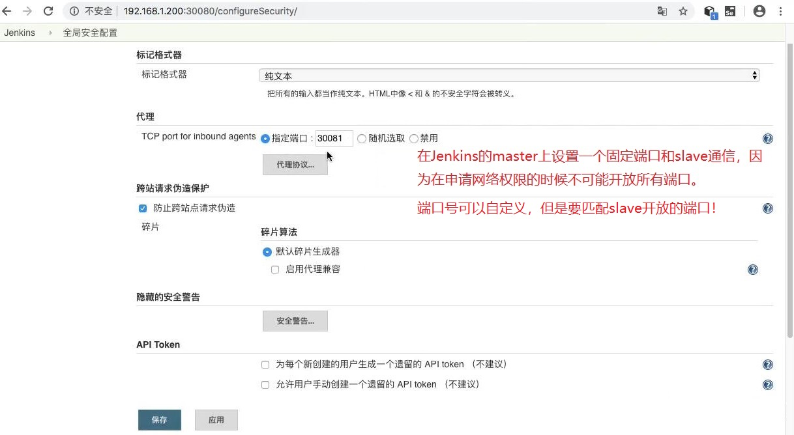
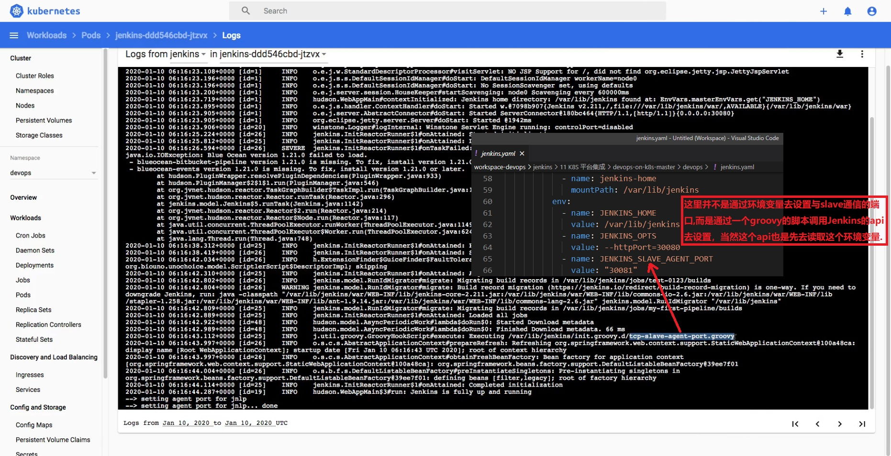

## 给 Pod 中的容器设置 host  ##
```
# jenkins.yaml
kind: Deployment
apiVersion: apps/v1
metadata:
  labels:
    k8s-app: jenkins
  name: jenkins
  namespace: devops
spec:
  replicas: 1
  revisionHistoryLimit: 10
  selector:
    matchLabels:
      k8s-app: jenkins
  template:
    metadata:
      labels:
        k8s-app: jenkins
      namespace: devops
      name: jenkins
    spec:
      // 设置 host  
      hostAliases:
      - ip: "192.168.1.200"
        hostnames:
          - "updates.jenkins-ci.org"
```

<br/><br/>

## 在Jenkins上设置一个固定port和slave通信  ##



<br/><br/>

## 通过yaml设置与slave通信端口的原理  ##
```
# jenkins.yaml
#......
    spec:
      hostAliases:
      - ip: "192.168.1.200"
        hostnames:
          - "updates.jenkins-ci.org"
      containers:
        - name: jenkins
          image: jenkins/jenkins:2.211
          imagePullPolicy: IfNotPresent
          ports:
            - containerPort: 30080
              name: web
              protocol: TCP
            - containerPort: 30081
              name: agent
              protocol: TCP
#......
```
