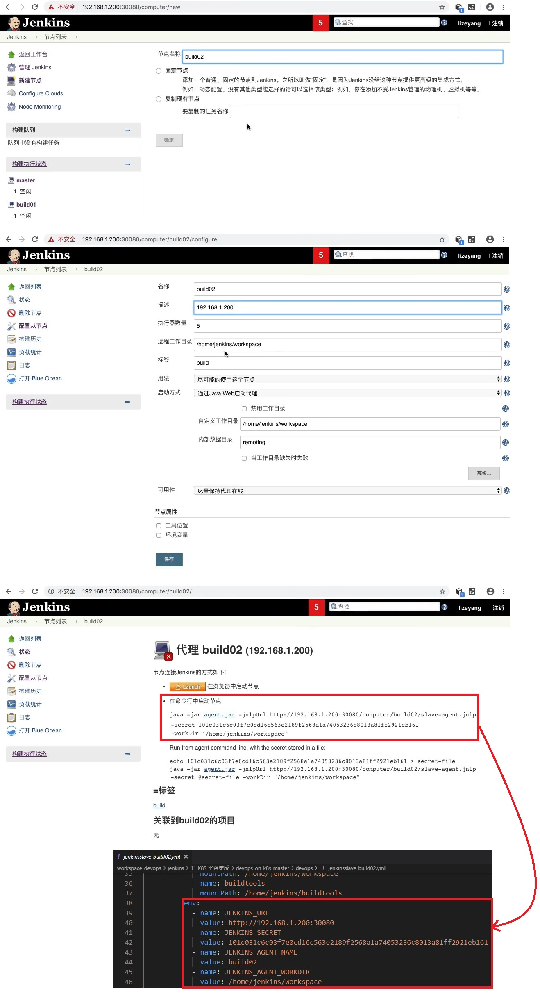

## Jenkins 静态 slave 创建图示 ##


<br/><br/>


## Jenkins 静态 slave yaml 文件 ##
```
# jenkinsslave-build02.yml
---
kind: Deployment
apiVersion: apps/v1
metadata:
  labels:
    k8s-app: jenkinsagent02
  name: jenkinsagent02
  namespace: devops
spec:
  replicas: 1
  revisionHistoryLimit: 10
  selector:
    matchLabels:
      k8s-app: jenkinsagent02
  template:
    metadata:
      labels:
        k8s-app: jenkinsagent02
      namespace: devops
      name: jenkinsagent02
    spec:
      containers:
        - name: jenkinsagent02
          image: jenkinsci/jnlp-slave:3.36-1
          imagePullPolicy: IfNotPresent
          resources:
            limits:
              cpu: 1000m
              memory: 2Gi
            requests:
              cpu: 500m
              memory: 512Mi
          volumeMounts:
            - name: jenkinsagent02-workdir
              mountPath: /home/jenkins/workspace
            # 挂载这个路径的目的是为了让slave使用maven、ant、nexues、sonar 等工具
            - name: buildtools
              mountPath: /home/jenkins/buildtools
          env:
            - name: JENKINS_URL
              value: http://192.168.1.200:30080
            - name: JENKINS_SECRET
              value: 101c031c6c03f7e0cd16c563e2189f2568a1a74053236c8013a81ff2921eb161
            - name: JENKINS_AGENT_NAME
              value: build02
            - name: JENKINS_AGENT_WORKDIR
              value: /home/jenkins/workspace
      volumes:
        - name: jenkinsagent02-workdir
          hostPath: 
            path: /data/devops/jenkins/workspace
            type: Directory
        - name: buildtools
          hostPath:
            path: /usr/local/buildtools
            type: Directory    
```