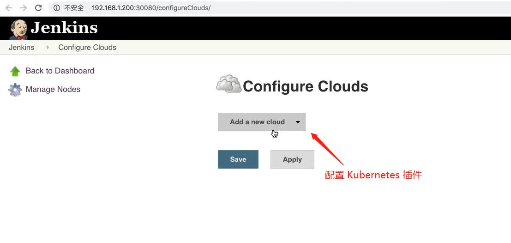
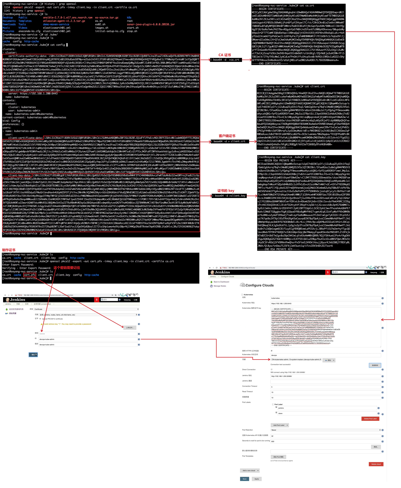

## Jenkins 动态 Slave 节点- ##
```
步骤:
  1. 首先在Jenkins中下载安装"Kubernetes"插件.
  2. 添加凭据(外部连接部署在Kubernetes中的Jenkins才需要凭据,内部连接不需要).
  3. 配置Kubernetes插件相关参数.
  4. 在Jenkins中运行pipeline脚本.

参考资料: https://github.com/zeyangli/Jenkinsdocs/blob/master/chapter/Jenkins-in-Openshift.md
```

<br/><br/>

## Jenkins 动态 slave 配置图示 ##



<br/><br/>

## 测试动态slave的pipeline脚本 ##
```
pipeline{
    agent{
        kubernetes{
            // 这里相当于给pod添加label, 当slave这个pod启动成功后名称为 test01-xxxxx-xxxxx
            // label  "${runserver}"
            label "test01"
            // 这个名称要和"configure Clouds"配置中的name值一样
            cloud 'kubernetes'
            yaml '''
---
kind: Pod
apiVersion: v1
metadata:
  labels:
    k8s-app: jenkinsagent
  name: jenkinsagent
  namespace: devops
spec:
containers:
  - name: jenkinsagent
    image: jenkins/inbound-agent:4.3-4
    imagePullPolicy: IfNotPresent
    resources:
      limits:
        cpu: 1000m
        memory: 2Gi
      requests:
        cpu: 500m
        memory: 512Mi
    volumeMounts:
      - name: jenkinsagent-workdir
        mountPath: /home/jenkins/workspace
      - name: buildtools
        mountPath: /home/jenkins/buildtools
    env:
      - name: JENKINS_AGENT_WORKDIR
        value: /home/jenkins/workspace
volumes:
  - name: jenkinsagent-workdir
    hostPath:
      path: /data/devops/jenkins/workspace
      type: Directory
  - name: buildtools
    hostPath:
      path: /usr/local/buildtools
      type: Directory
'''
        }
    }


    stages{
        stage("test"){
          steps{
            script{
              sh "sleep 30"
            }
          }
        }
    }
}

```