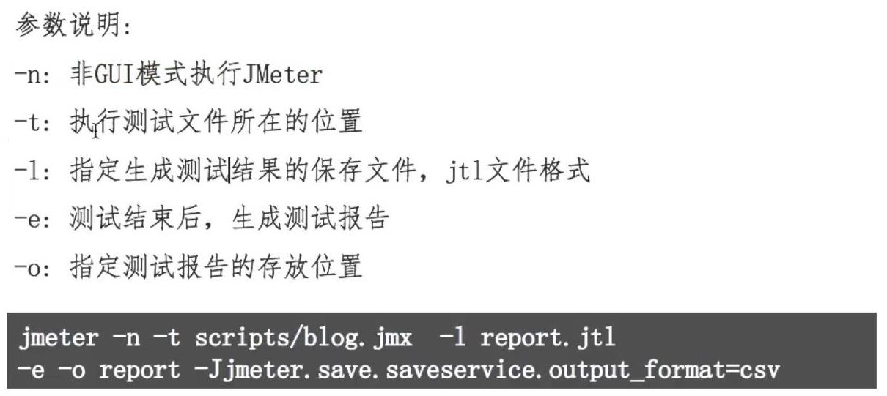
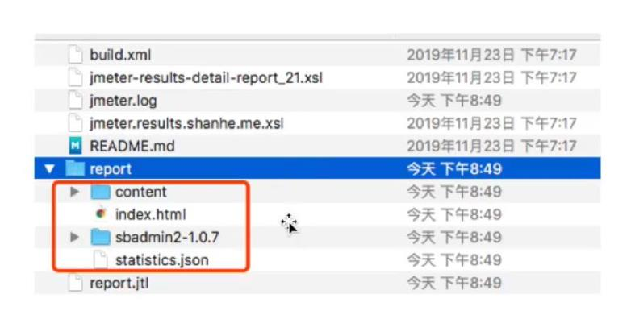
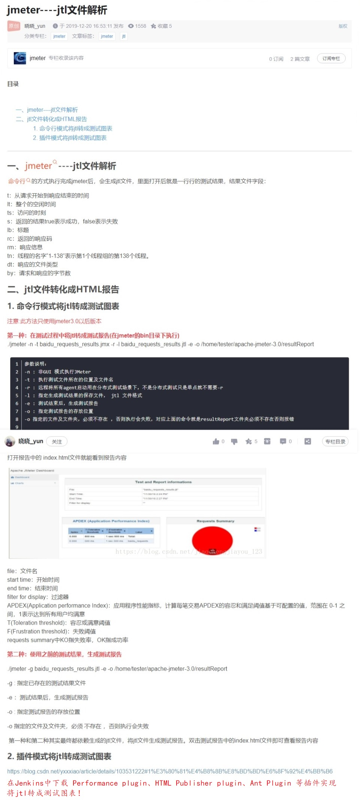

## 1. Jmeter 接口测试生成报告- ##
```
1. Jmeter主要做性能测试, 但是也能做接口测试
2. Jmerter跑测试的两种方式:
    2.1 图像化界面配置相关参数, 或者直接导入 jmx 测试脚本文件
    2.2 命令行界面直接使用 jmx 测试脚本文件
3. 扩展: 可以用包含jemeter应用的容器跑自动化测试
4. 运行Jemter后会产生jtl文件,这个文件可以用来生成html格式的报告
```

<br/>

## 2. Jemetr在命令行下面的使用方式 ##


<br/>

## 3. Jemetr目录 ##



<br/>

## 4. 参考资料 ##
```
jmeter----jtl文件解析: https://blog.csdn.net/yxxxiao/article/details/103530196
Ant+Jmeter+Jenkins持续集成 (一): https://blog.csdn.net/yxxxiao/article/details/103531222#1%E3%80%81%E4%B8%8B%E8%BD%BD%E6%8F%92%E4%BB%B6
```