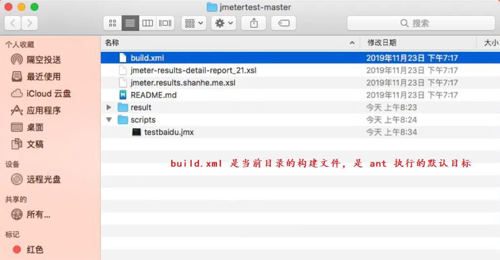
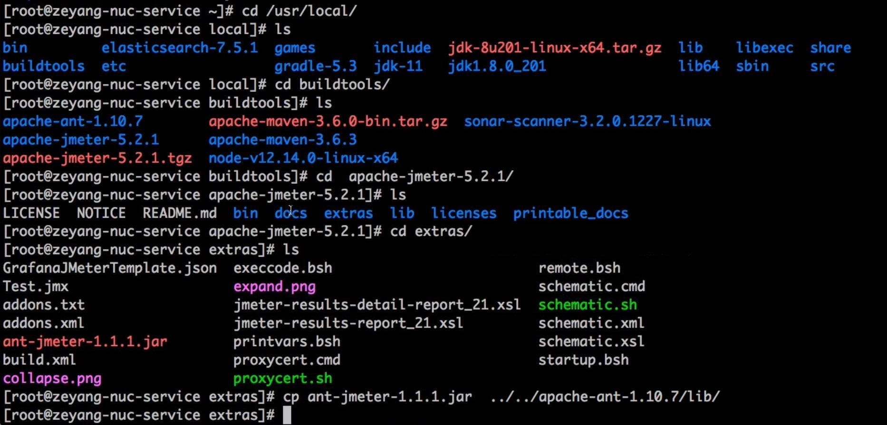

## 使用 Ant、Jmeter 自动化测试 ##
```
1. Ant 是个构建工具, Ant + Jemeter 可以实现批量执行(其实就是调用多个 jemeter 的 jmx 脚本文件).
2. ant + jmeter 自动化测试项目示例: 
    项目: jmetertest-master
    github: https://github.com/zeyangli/jmetertest
```

<br/>

## Ant 项目的目录结构 ##


<br/>

## "build.xml"文件是 Ant 的默认执行目标 ##


<br/>

## Ant 集成 Jemeter的方式: 把 .../apache-jemeter-5.2.1/extras/ant-jemeter-1.1.1.jar 拷贝到 .../apache-ant-1.10.7/lib ##
