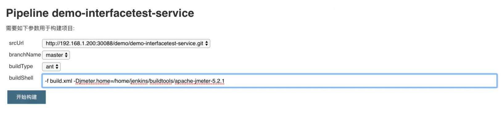
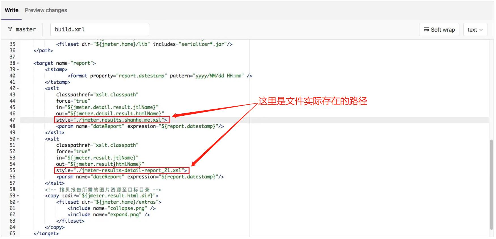

## Jenkins 构建参数设置 ##


<br/><br/>

## build.xml 注意事项 ##


<br/><br/>

## interfaceTest.jenkinsfile 脚本 ##
```
#!groovy

@Library('jenkinslibrary@master') _

// func from share library
def build = new org.devops.build()
def tools = new org.devops.tools()
def toemail = new org.devops.toemail()


// env
String buildType = "${env.buildType}"
String buildShell = "${env.buildShell}"
String srcUrl = "${env.srcUrl}"
String branchName = "${env.branchName}"

userEmail = "xxxxxx@163.com"

// pipeline
pipeline{
    
    agent{node {label "master"}}
    
    stages{
        stage("CheckOut"){
            steps{
                script{
                    println("${branchName}")

                    tools.PrintMes("获取代码", "green")
                    // 下面的代码可以通过流水线语法生成
                    checkout([$class: 'GitSCM', branches: [[name: "${branchName}"]], doGenerateSubmoduleConfigurations: false, extensions: [], submoduleCfg: [], userRemoteConfigs: [[credentialsId: 'gitlab-admin-user', url: "${srcUrl}"]]])
                }
            }
        }

        stage("build"){
            steps{
                script{
                  tools.PrintMes("打包代码", "green")
                  build.Build(buildType, buildShell)
                }
            }
        }

    post {
        always {
            script {
                println("always")
            }
        }

        success{
            script {
                println("success")
                // userEmail 通过解析  webhook 请求传过来的reqeust body 拿到, 所以在 GitLab 账户要配置上 email
                toemail.Email("流水线成功", userEmail)
            }            
        }

        failure {
             script {
                println("failure")
                toemail.Email("流水线失败", userEmail)
            }              
        }
        
        aborted {
              script {
                println("cancel")
                toemail.Email("流水线被取消", userEmail)
            }             
        }
    }
}
```