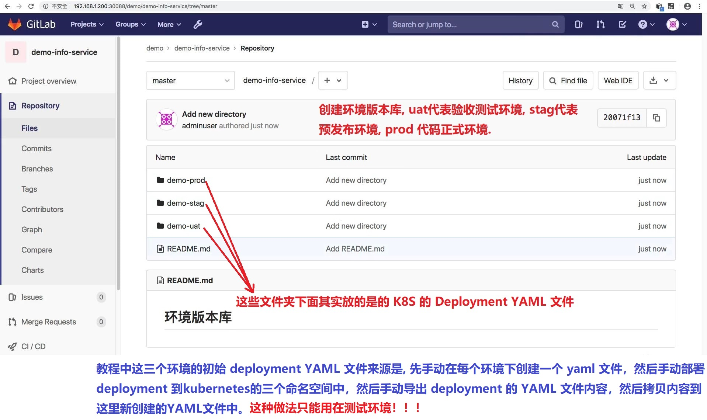
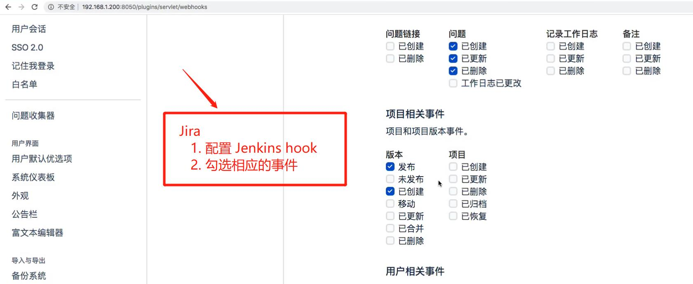
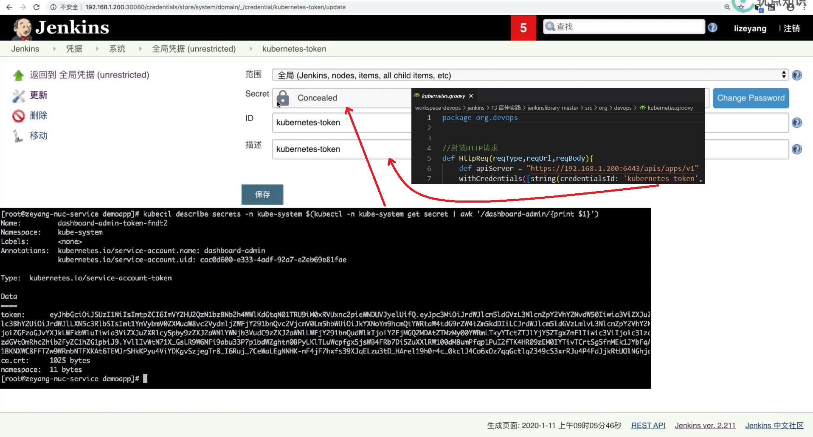
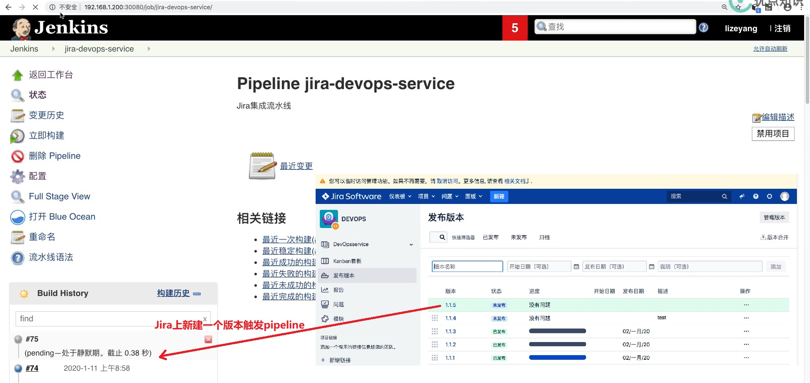
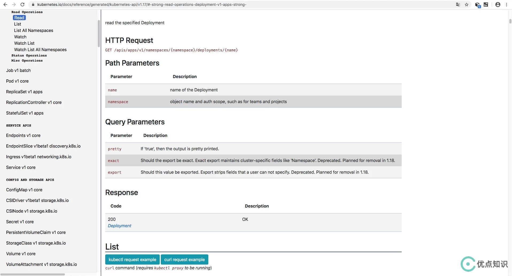

## 需求: 通过"kubernetes API"获取 ##
```
本节用到的资源: 
    jenkins\13 最佳实践\jenkinslibrary-master\src\org\devops\kubernetes.groovy
    jenkins\13 最佳实践\jenkinslibrary-master\jenkinsfiles\jira.jenkinsfile
```

<br/>

### jira.jenkinsfile ###
```
# webHookData 和 projectKey 通过 Jira 调用Jenkins的hook衔接传递过来
......
        stage("CreateVersionFile"){
            when {
                environment name: 'eventType', value: 'jira:version_created' 
            }
            
            steps{
                script{
                    //获取K8s文件
                    k8s.GetDeployment("demo-uat","demoapp")
                }
            
            }
        }
......
```

<br/>



<br/>



<br/>



<br/>



<br/>

