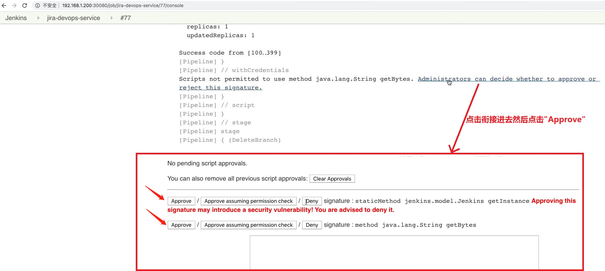
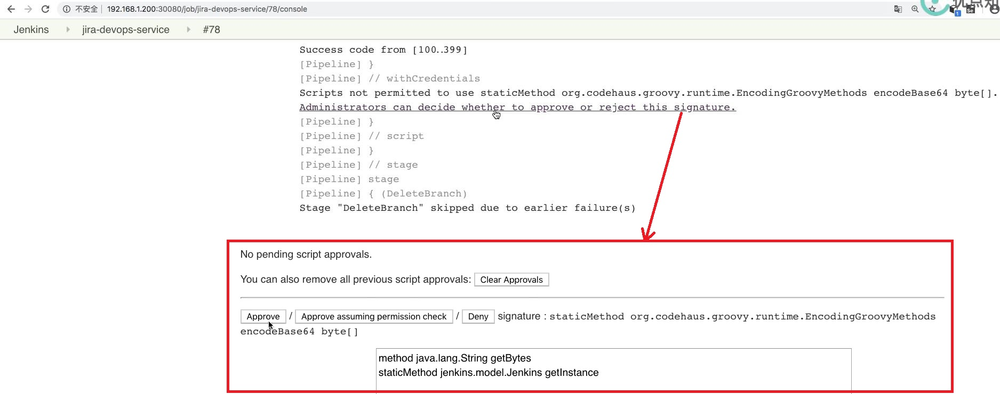

## 需求: 上传 K8S 部署文件到 Gitlab- ##
```
本节用到的资源: 
    jenkins\13 最佳实践\jenkinslibrary-master\src\org\devops\kubernetes.groovy
    jenkins\13 最佳实践\jenkinslibrary-master\jenkinsfiles\gitlab.groovy
    jenkins\13 最佳实践\jenkinslibrary-master\jenkinsfiles\jira.jenkinsfile
```

<br/>

## jira.jenkinsfile ##
```
# webHookData 和 projectKey 通过 Jira 调用Jenkins的hook衔接传递过来
......
        stage("CreateVersionFile"){
            when {
                environment name: 'eventType', value: 'jira:version_created' 
            }
            
            steps{
                script{
                    //获取K8s文件
                    response = k8s.GetDeployment("demo-uat","demoapp")
                    response = response.content
                    //文件转换,这里要使用base, 否则处理换行符很麻烦
                    base64Content = response.bytes.encodeBase64().toString()
                   //上传文件
                   gitlab.CreateRepoFile(7,"demo-uat%2f${versionName}-uat.yaml",base64Content)
                }
            
            }
        }
......
```

<br/>

## Pipeline 运行过程中可能出现的错误以及解决方式 ##
  
  