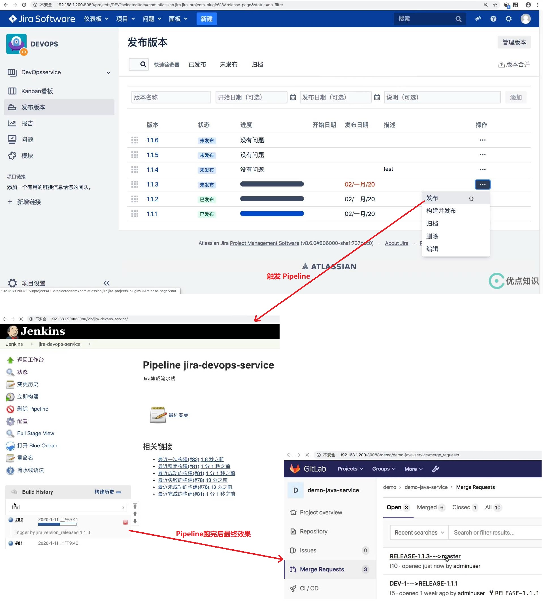

## 需求: 发布版本触发分支合并- ##
```
本节用到的资源: 
    jenkins\13 最佳实践\jenkinslibrary-master\src\org\devops\kubernetes.groovy
    jenkins\13 最佳实践\jenkinslibrary-master\jenkinsfiles\gitlab.groovy
    jenkins\13 最佳实践\jenkinslibrary-master\jenkinsfiles\jira.jenkinsfile
```

## jira.jenkinsfile ##
```
# webHookData 和 projectKey 通过 Jira 调用Jenkins的hook衔接传递过来
......
        stage("DeleteBranch"){
            when {
                environment name: 'eventType', value: 'jira:version_released'   
            }
            
            steps{
                script{
                    //获取issuesName
                    println("project%20%3D%20${projectKey}%20AND%20fixVersion%20%3D%20${versionName}%20AND%20issuetype%20%3D%20Task")
                    response = jira.RunJql("project%20%3D%20${projectKey}%20AND%20fixVersion%20%3D%20${versionName}%20AND%20issuetype%20%3D%20Task")
                    
                    response = readJSON text: """${response.content}"""
                    println(response)
                    issues = [:]
                    for ( issue in response['issues']){
                        println(issue["key"])
                        println(issue["fields"]["components"])
                        issues[issue["key"]] = []
                        
                        //获取issue关联的模块
                        for (component in issue["fields"]["components"] ){
                            issues[issue["key"]].add(component["name"])
                        }
                    
                    }
                    
                    println(issues)
                    
                    
                    //搜索gitlab分支是否已合并然后删除
                    
                    
                    for (issue in issues.keySet()){
                        for (projectName in issues[issue]){
                            repoName = projectName.split("-")[0]
                            projectId = gitlab.GetProjectID(repoName, projectName)
                            
                            try {
                                // 创建合并请求
                                println("创建合并请求  RELEASE-${versionName}  ---> master")
                                result = gitlab.CreateMr(projectId,"RELEASE-${versionName}","master","RELEASE-${versionName}--->master")
                                result = readJSON text: """${result}"""
                                mergeId = result["iid"]
                                gitlab.AcceptMr(projectId,mergeId)
                                
                                sleep 15
                            } catch(e){
                                println(e)
                            }
                            response = gitlab.SearchProjectBranches(projectId,issue)
                            
                            println(response[projectId][0]['merged'])
                            
                            if (response[projectId][0]['merged'] == false){
                                println("${projectName} --> ${issue} -->此分支未合并暂时忽略！")
                            } else {
                                println("${projectName} --> ${issue} -->此分支已合并准备清理！")
                                gitlab.DeleteBranch(projectId,issue)
                            }
                        
                        }

                    }
                }
            }
        }
......
```

<br/>

## 流程 ##

  