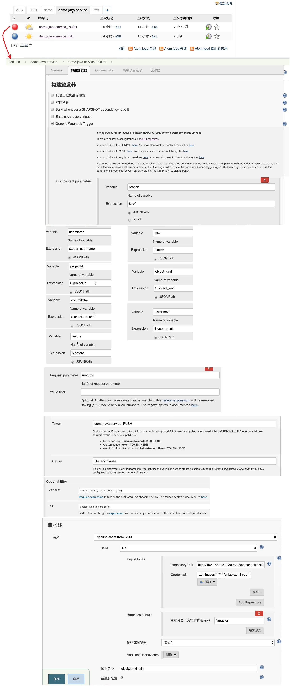
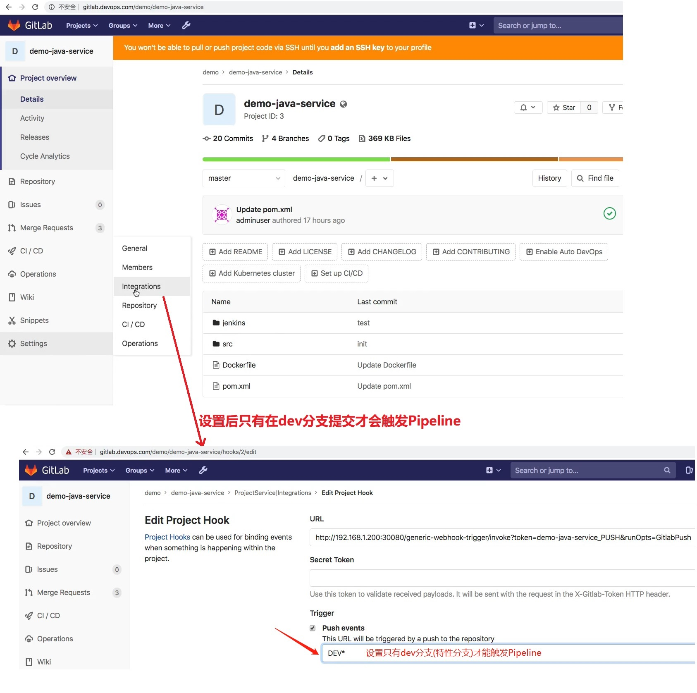
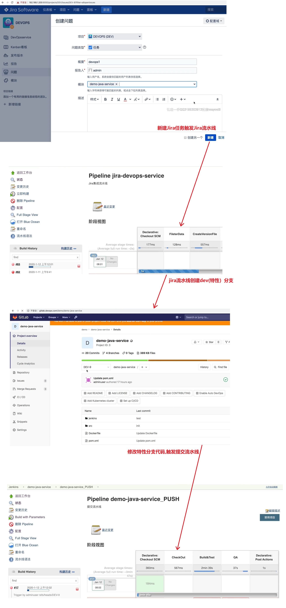
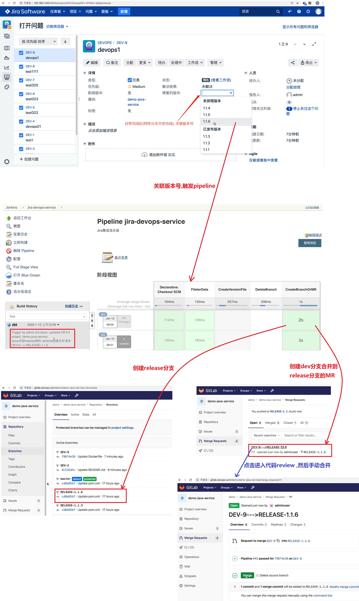

## 需求: 提交流水线  ##
```
用到的 Jenkinsfile :
    Jira流水线: jenkins\13 最佳实践\jenkinslibrary-master\jenkinsfiles\jira.jenkinsfile
    提交流水线: jenkins\13 最佳实践\jenkinslibrary-master\jenkinsfiles\gitlab.jenkinsfile
```

<br/>

## 1. 提交流水线 Jenkins设置  ##
```
变量before实际上就是commitID, 如果commitID是40个0说明是新建分支。
```


<br/>

## 2. 提交流水线Gitlab设置  ##


<br/>

## 3. 阶段一: Jira流水线和提交流水线联动  ##
```
jira创建任务 -> 触发 Jiar Pipeline 创建特性分支 -> 修改特性分支代码 -> 触发提交 pipeline  
```


<br/>

## 4. 阶段二: Jira流水线创建release分支以及MR  ##
```
 Jira任务完成(特性分支开发完成) -> Jira关联版本号 -> 触发Jira流水线(创建release分支以及dev合并到master的MR) -> 代码review,手动merge
```

