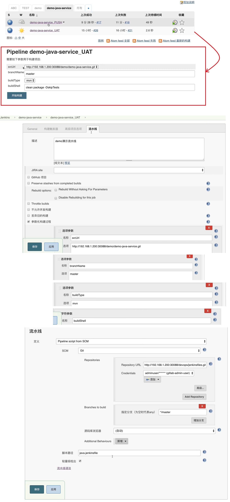
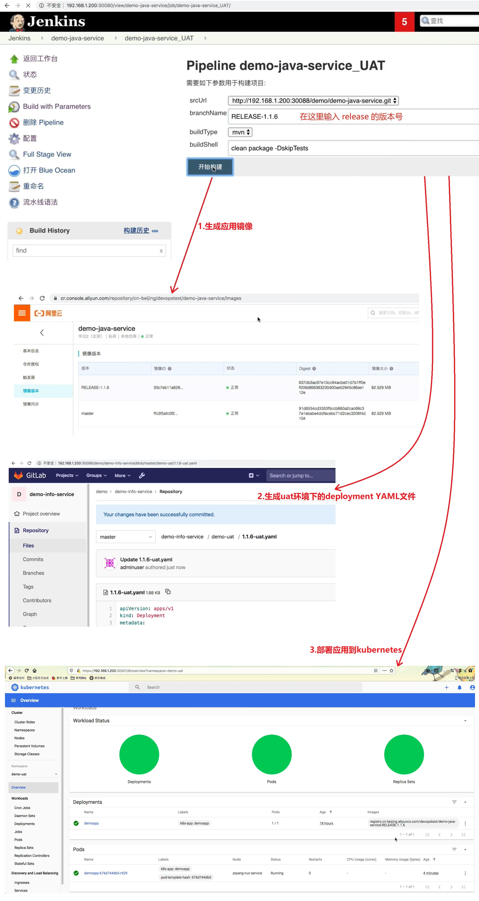

## UAT 流水线构建镜像 ## 
```
用到的资源:
    jenkins\13 最佳实践\jenkinslibrary-master\jenkinsfiles\java.jenkinsfile

当生成release分支后就需要上uat环境, uat流水线过程如下:
    拉取代码 -> 编译 -> 单测 -> 打包 -> 扫描 -> 镜像 -> 发布 -> 接口测试 -> 生成版本文件 -> 邮件通知

docker in docker 打包镜像注意事项:
    1. 如果 jenkins slave pod 也在 k8s 集群中,而这个集群中同时也包含业务容器, 因为业务容器底层也是使用docker, 那么docker构建镜像会影响docker性能, 也存在安全问题.
    2. 专门使用一台机器或k8s节点作为 Jenkins slave 来解决上述问题. 
```

<br/>

## UAT 流水线 Jenkins 设置 ## 


<br/>

## 运行 UAT 流水线 ## 
```
当生成release版本后,手动开启 UAT 流水线
```

