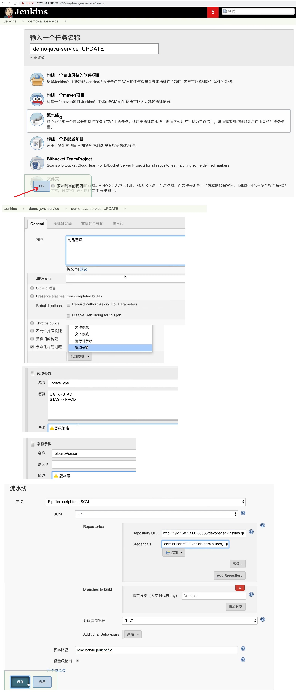
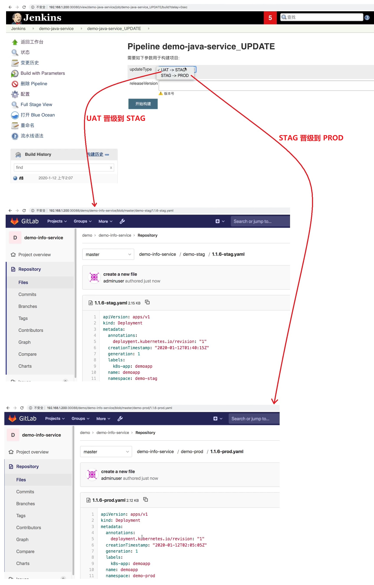

## 配置版本晋级流水线- ##
```
Pipeline 脚本:
    jenkins\13 最佳实践\jenkinslibrary-master\jenkinsfiles\newupdate.jenkinsfile

晋级流程(晋级一般是指制品晋级,在这里是指镜像文件晋级,部署到kubernetes中的 deployment YAML 文件晋级): 
    uat发布成功 -> 晋级到预生产 --> 晋级到生产
```

<br/>

## 1. 晋级流水线Jenkins配置 ##


<br/>

## 2. 运行晋级流水线 ##


