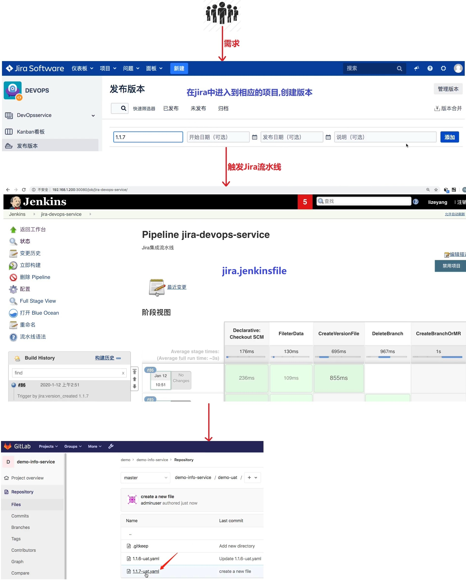
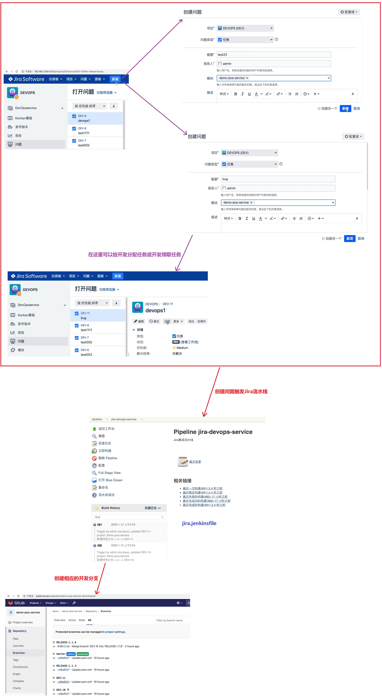
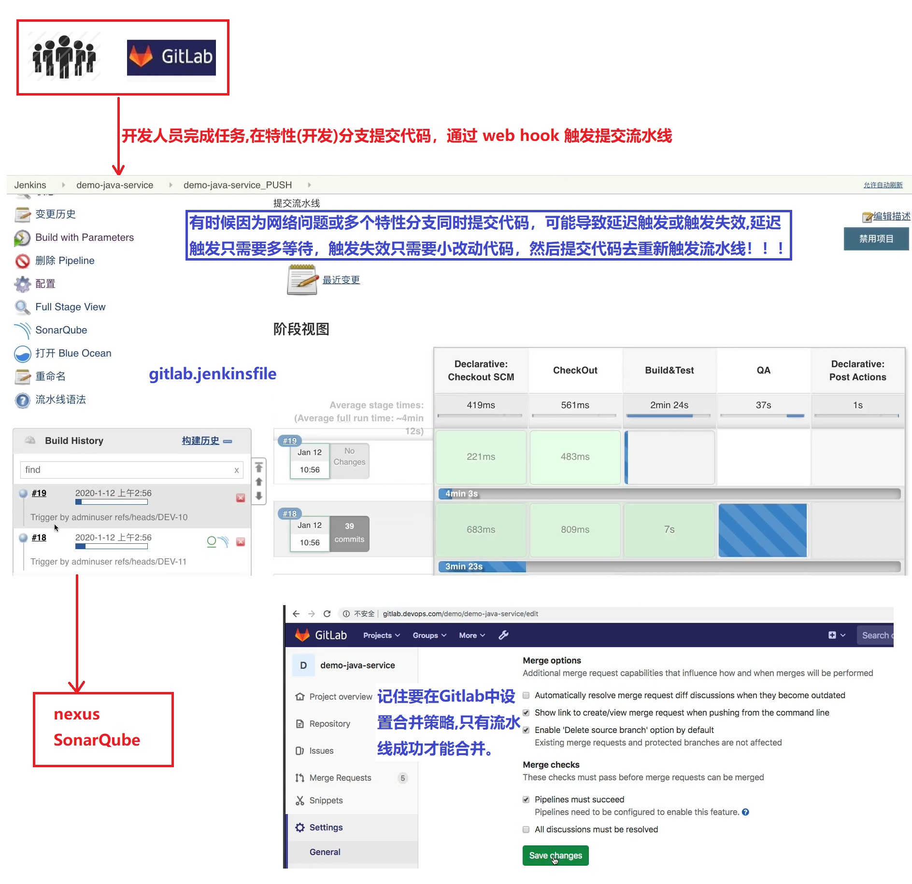
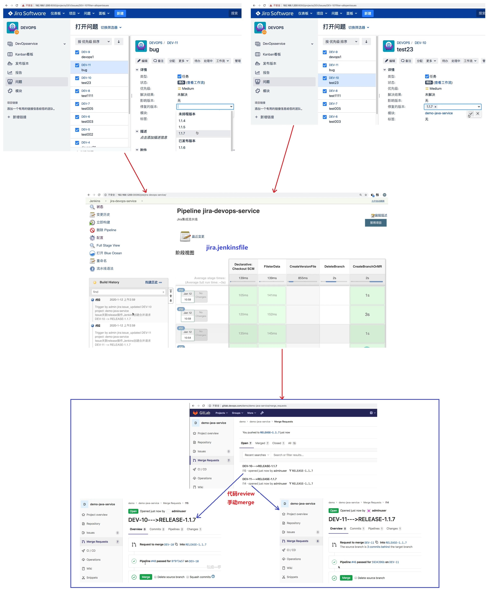
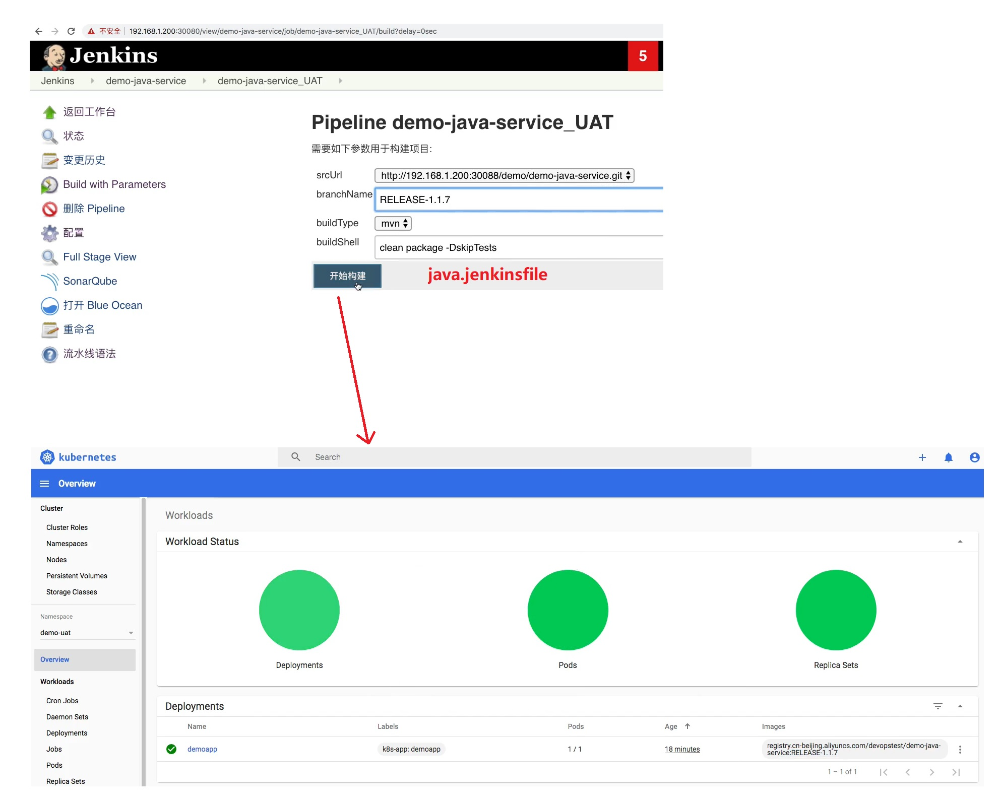
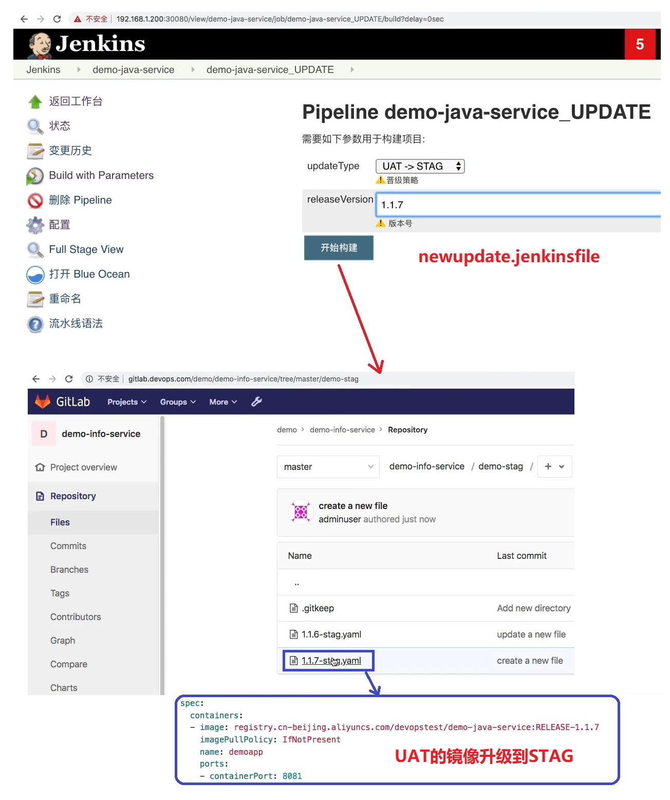
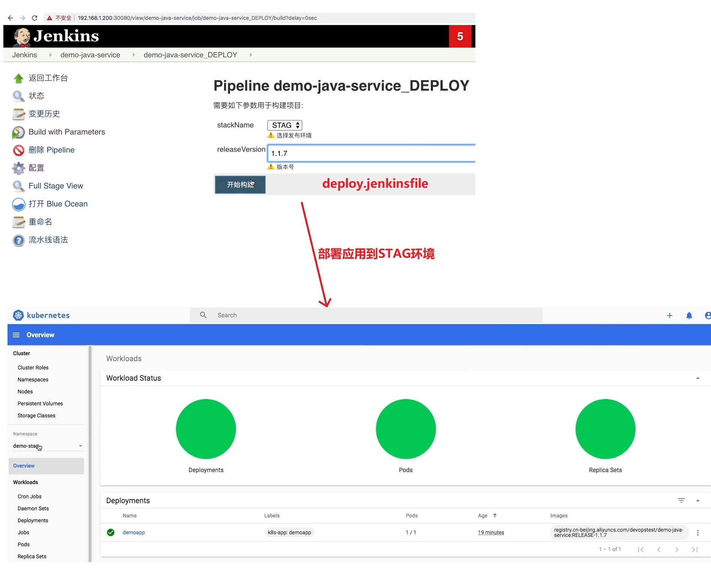
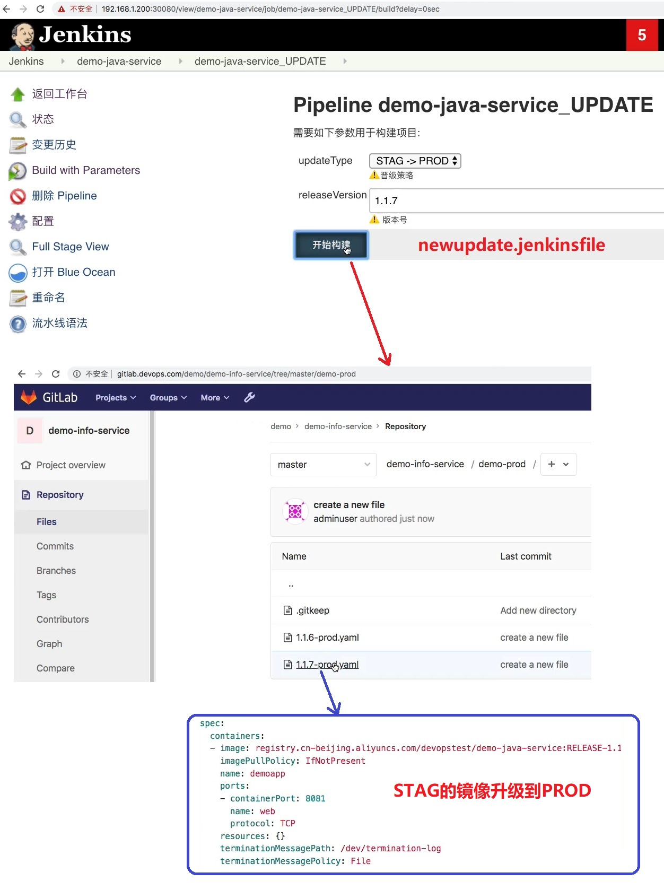
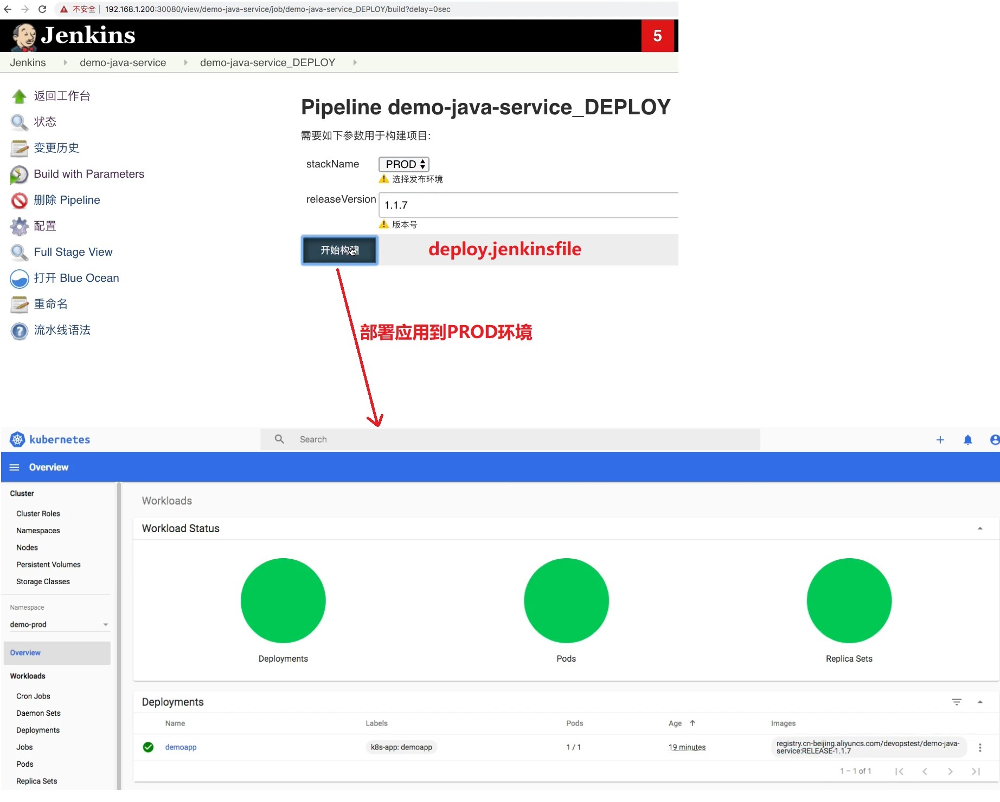
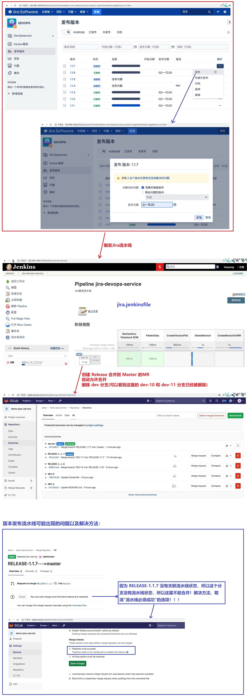

## 总结: 演示端到端完整过程- ##

<br/><br/>

## stage_1: Jira上创建版本,触发JIra流水线 ==> jira.jenkinsfile ##
```
来需求 -> 在jira中进入到相应的项目,创建版本 --> 触发Jira流水线(在uat环境下生成deployment YAML文件)
```


<br/>

## stage_2: Jira上创建任务,触发JIra流水线 ==> jira.jenkinsfile ##
```
在jira中创建任务(这时开发就可以在Jira领任务) --> 触发Jira流水线(创建相应的开发分支)
```


<br/>

## stage_3: 开发人员完成任务,提交代码触发提交流水线 ==> gitlab.jenkinsfile ##
```
开发人员完成任务,在特性(开发)分支提交代码 --> 触发提交流水线(nexus、SonarQube)
```


<br/>

## stage_4: Jira上面关联版本,触发Jira流水线 ==> jira.jenkinsfile ##
```
Jira上面关联版本 -->  触发Jira流水线(创建release分支,以及dev分支合并到release分支的MR) --> 在gitlab上review然后手动merge
	
```


<br/>

## stage_5: 发应用到UAT ==> java.jenkinsfile ##
```
触发UAT流水线(打包镜像,部署到kubernetes)  -->  测试(这步省略,可以人工测试,也可以使用一些测试框架写测试项目结合pipeline自动化测试)
```


<br/>

## stage_6: 镜像晋级,UAT镜像升级到STAG ==> newupdate.jenkinsfile ##
```
触发晋级流水线(UAT镜像升级到STAG)
```


<br/>

## stage_7: 发预生产 ==> deploy.jenkinsfile ##
```
触发部署流水线(部署应用到STAG环境)  -> 测试(这步省略,可以人工测试,也可以使用一些测试框架写测试项目结合pipeline自动化测试)
```


<br/>

## stage_8: 镜像晋级,STAG镜像升级到PROD ==> newupdate.jenkinsfile ##
```
触发晋级流水线(STAG镜像升级到Prod)
```


<br/>

## stage_9: 发生产 ==> deploy.jenkinsfile ##
```
触发部署流水线(部署应用到PROD环境) 
```


<br/>

## stage_10: 版本发布 ==> jira.jenkinsfile ##
```
Jira上点击发布版本 --> 触发Jira流水线(创建release到mster的MR,自动允许合并，合并后自动删除特性(开发)分支 
```
