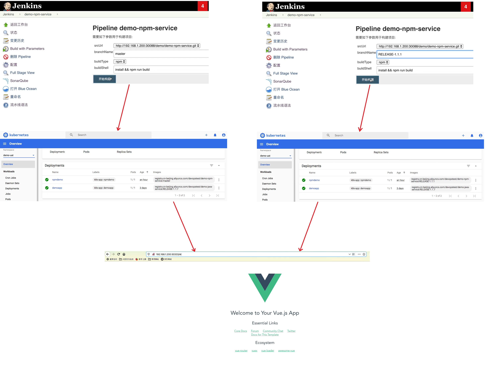

## NodeJs 项目流水线实践 ## 
```
JenkinsFile:
    jenkins\13 最佳实践\jenkinslibrary-master\jenkinsfiles\npm.jenkinsfile
前端项目:
    jenkins\13 最佳实践\gitlabci-cidevops-npm-service-master
Github Repo:
    https://github.com/zeyangli/gitlabci-cidevops-npm-service
```

<br/><br/>

