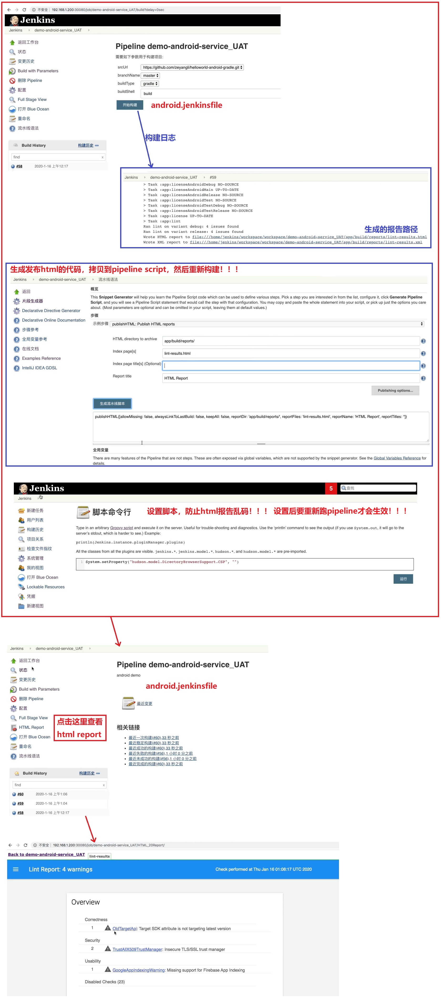
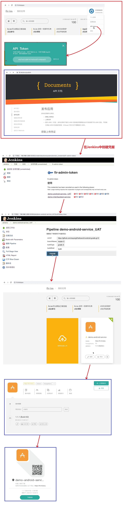

## Android 流水线上传到 FIR 平台- ##
```
Jenkins file:
    jenkins\13 最佳实践\jenkinslibrary-master\jenkinsfiles\android.jenkinsfile
Share Libreay:
    jenkins\13 最佳实践\jenkinslibrary-master\src\org\devops\android.groovy
注意:
    Fir提供了Jenkins插件,但是很难用,如果不封装API,使用图形界面的话还是可以使用Fir提供的插件
```

<br/><br/>

## 1. 生成 Html Report ##


<br/><br/>

## 2. 发布应用到 fir ##
