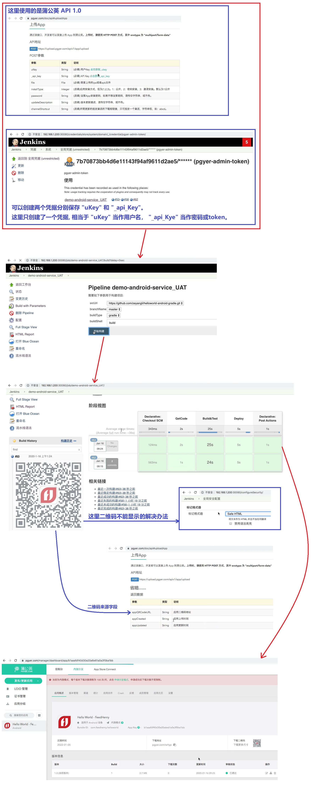

## Android 流水线上传到蒲公英平台- ##
```
Jenkins file:
    jenkins\13 最佳实践\jenkinslibrary-master\jenkinsfiles\android.jenkinsfile
Share Libreay:
    jenkins\13 最佳实践\jenkinslibrary-master\src\org\devops\android.groovy
```

<br/><br/>

## 发布应用到蒲公英 ##
