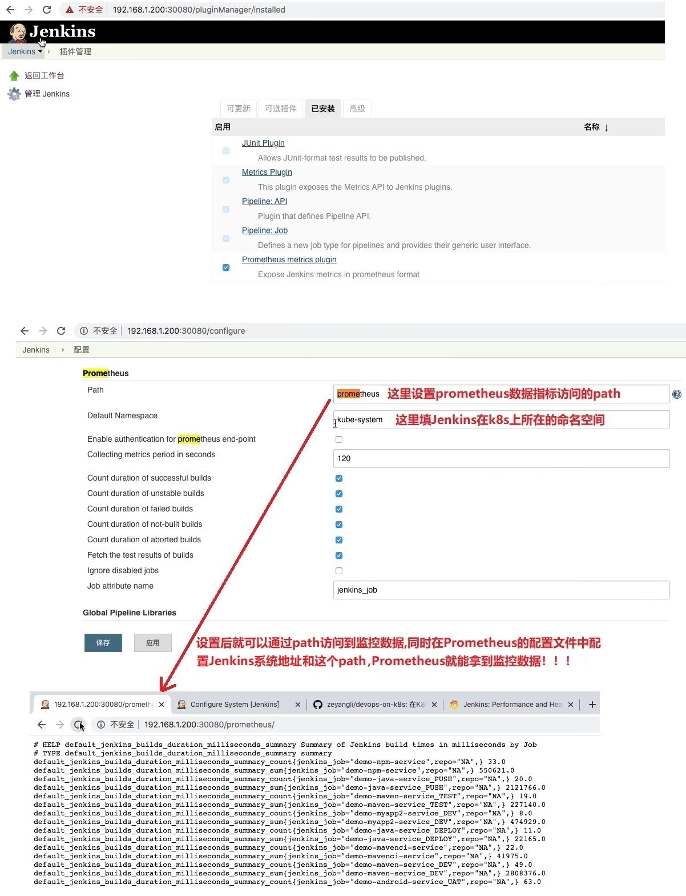
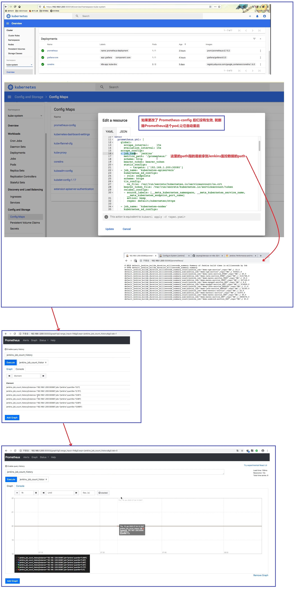
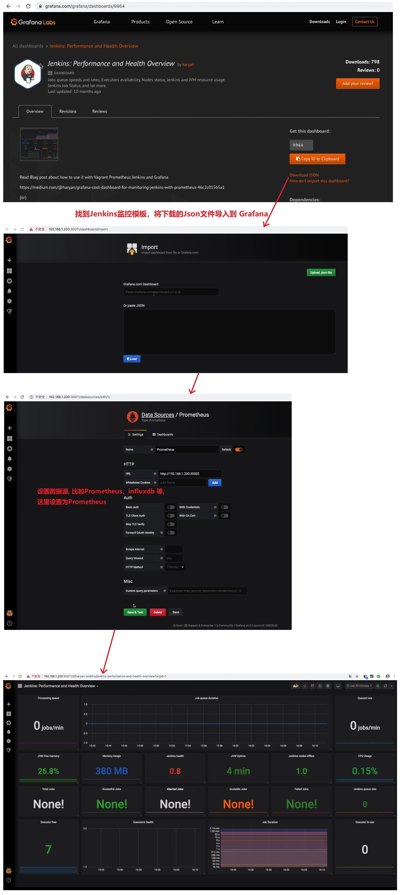

## 使用 Prometheus 监控 Jenkins- ##
```
本章主要内容是 Jenkins 的监控、数据备份、api

使用 Prometheus 监控 Jenkins
    1. 安装 Prometheus metrics 插件,然后重启
    2. 然后在Jenkins的系统设置中进行设置
    3. 设置 Prometheus
    4. 设置 Grafana
```

<br/><br/>

## 1. Jenkins上安装Prometheus插件以及设置 ##


<br/><br/>

## 2. Prometheus设置 ##


<br/><br/>

## 3. Grafana设置 ##
