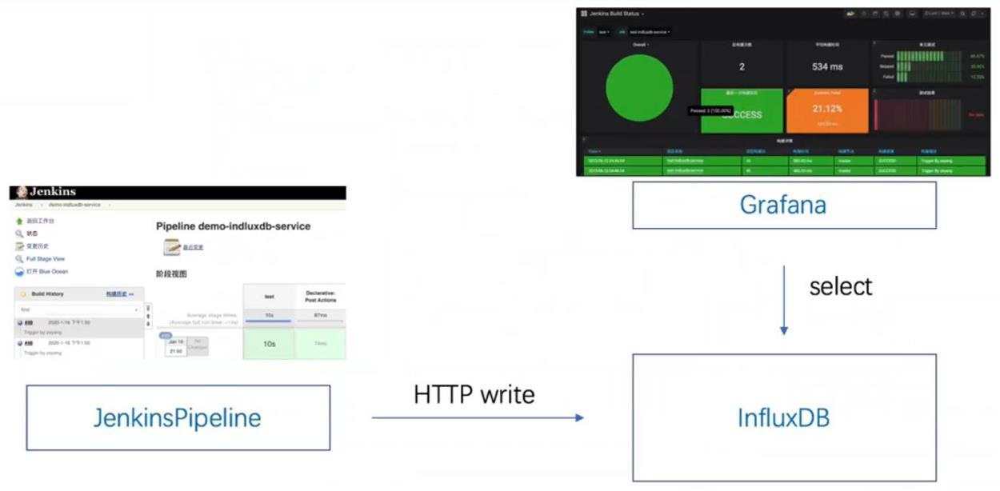
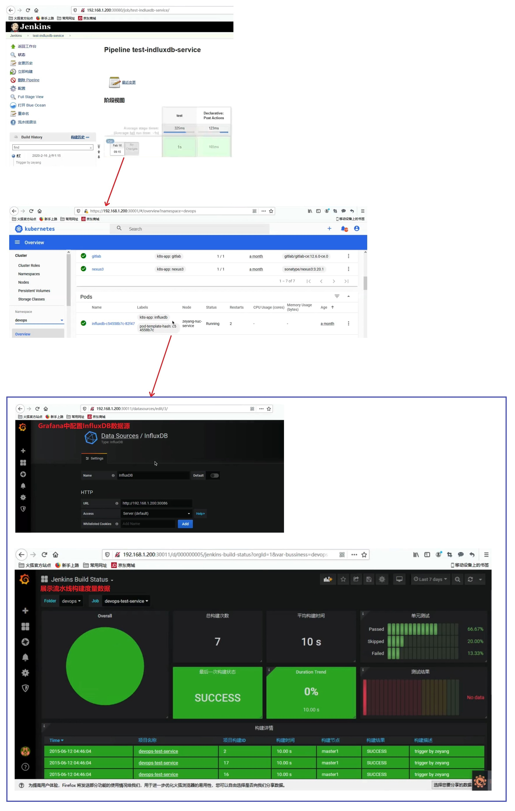
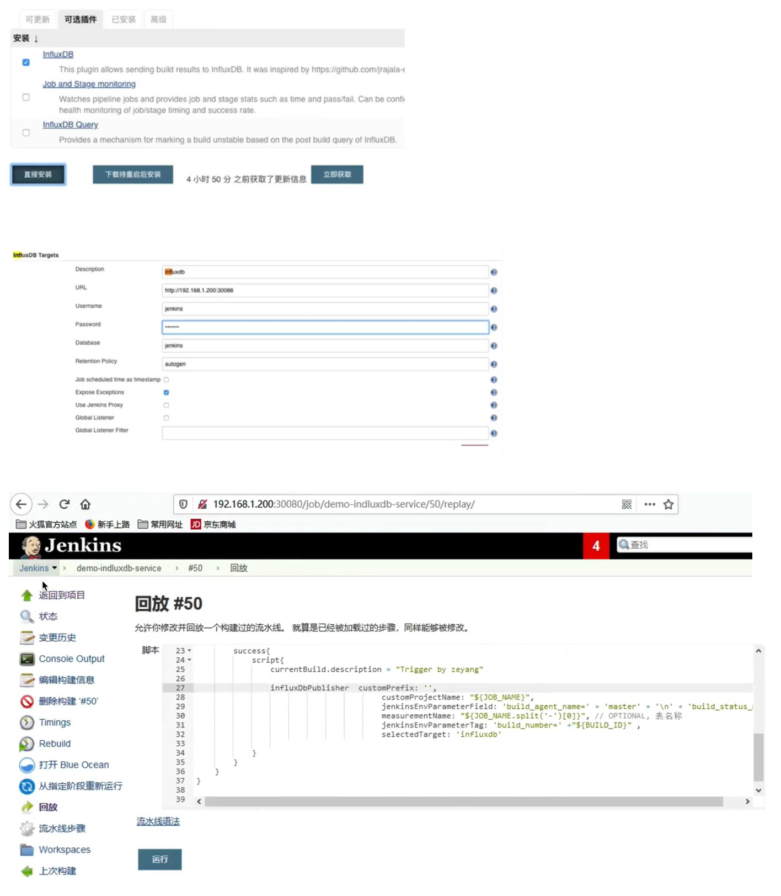

## 收集流水线构建度量数据- ##
```
Jenkinsfile:
    jenkins\14 扩展\jenkinslibrary-master\jenkinsfiles\influxdb.jenkinsfile

ShareLibrary:
    jenkins\14 扩展\jenkinslibrary-master\src\org\devops\influxdb.groovy

influxdb是"时序数据库", 可以调用api接口进行操作.
    influxDB也有Jenkins插件,名为"InfluxDB"，但是这个插件使用起来不太灵活，而且自定义容易出错

展示流水线构建度量数据的Grafana模板文件(这是个json格式的模板文件,需要导入到Grafana中):
    jenkins\14 扩展\jenkinslibrary-master\Jenkins Build Status-1581816279044.json

```

<br/><br/>

## 1.Grafana展示Jenkins度量数据过程 ##


<br/><br/>

## 2.Grafana展示Jenkins度量数据实践 ##


<br/><br/>

## 3.Jenkins的influxDB插件 ##
