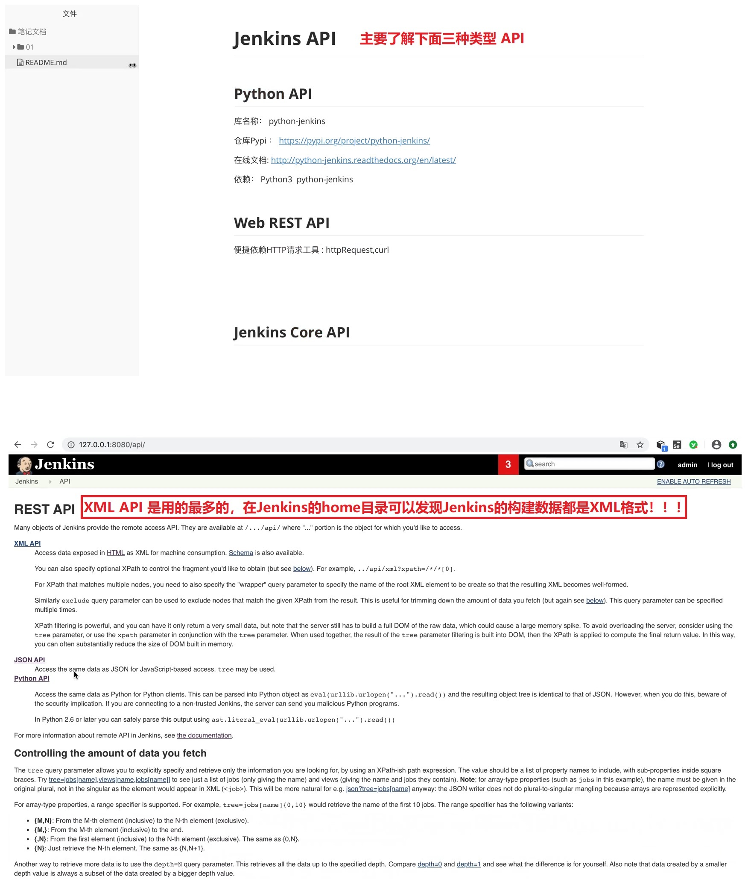
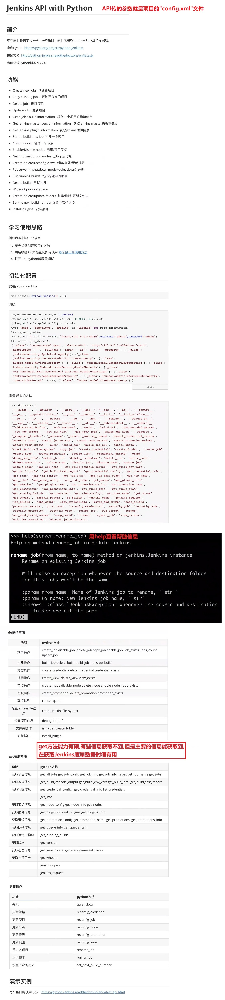
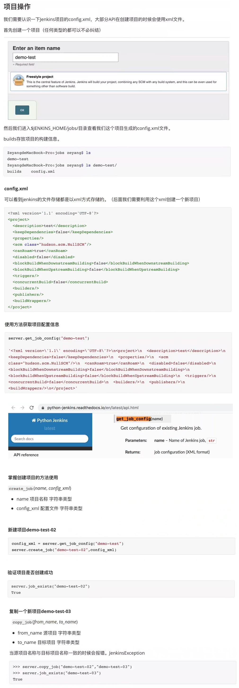
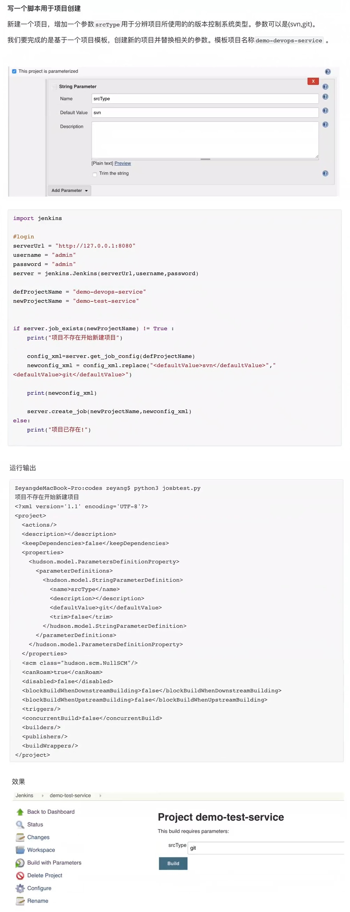

## Jenkins Python API ##
```
库名称: python API
仓库Pypi: https://pypi.org/project/python-jenkins/
在线文档: https://python-jenkins.readthedocs.io/en/latest/

使用"python API"创建项目的大体思路:
    因为jenkins已经设置config是xml格式,所以先必须找到一个xml或自己拼装一个xml文件,然后根据每个项目不同的值去替换xml中的值,然后再调用创建项目的这个方法去创建Job.
```

<br/><br/>

## 1. Jenkins API 介绍 ##


<br/><br/>

## 2. Jenkins Python API 的使用 ##



