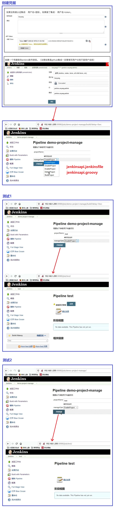

## Jenkins REST API 共享库封装, 实现效果:用Jenkins操作Jenkins ##
```
Jenkinsfile:
    jenkins\14 扩展\jenkinslibrary-master\jenkinsfiles\jenkinsapi.jenkinsfile

Share Library:
    jenkins\14 扩展\jenkinslibrary-master\src\org\devops\jenkinsapi.groovy
```

<br/><br/>

