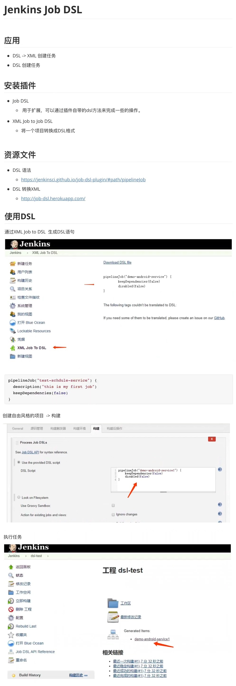
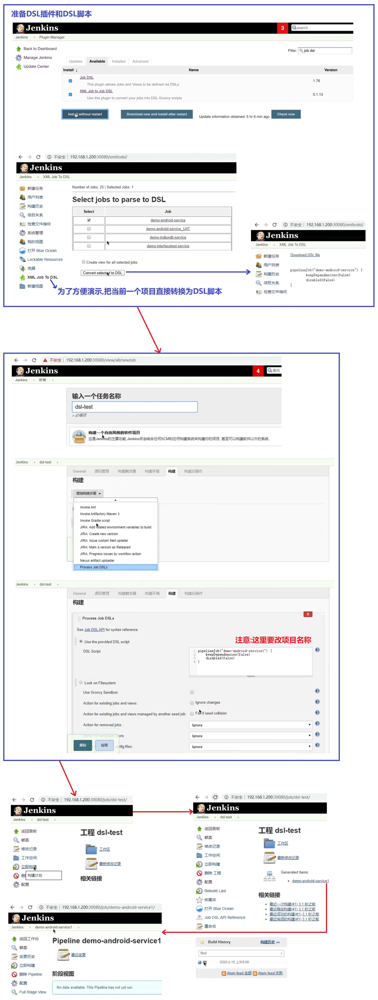
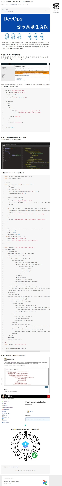

## Jenkins Job DSL(domain-specific language) 应用实践 ##
```
DSL有两种意思:
    动态脚本语言(Dynamic Script Language)
	领域特定语言(domain-specific language):指的是专注于某个应用程序领域的计算机语言。又译作领域专用语言。

Jenkins Job DSL 插件:
    Jenkins下载"JobDSL"插件后就支持使用DSL创建JOB,相当于多了一种方式去操作Jenkins,通过DSL可以创建各种job。

XML Job to Job DSL 插件:
    这个插件可以用来DSL和XML互相转换,比如现在要备份一个项目,就可以导出这个项目,变成DSL, 后面执行dsl又可以恢复这个项目。
    可以通过"http://job-dsl.herokuapp.com/"把DSL转化为XML。

参考资料: 
    jenkins\14 扩展\readee-ref-resource\99\实践_ Jenkins Core Api & Job DSL创建项目.html
    https://mp.weixin.qq.com/s/LitL26RB-mf3Kt-rVLwQUg    
```

<br/><br/>

## 1. DSL文档 ##


<br/><br/>

## 2. DSL创建项目示例子 ##


<br/><br/>

## 3. 资料:DSL创建项目 ##
