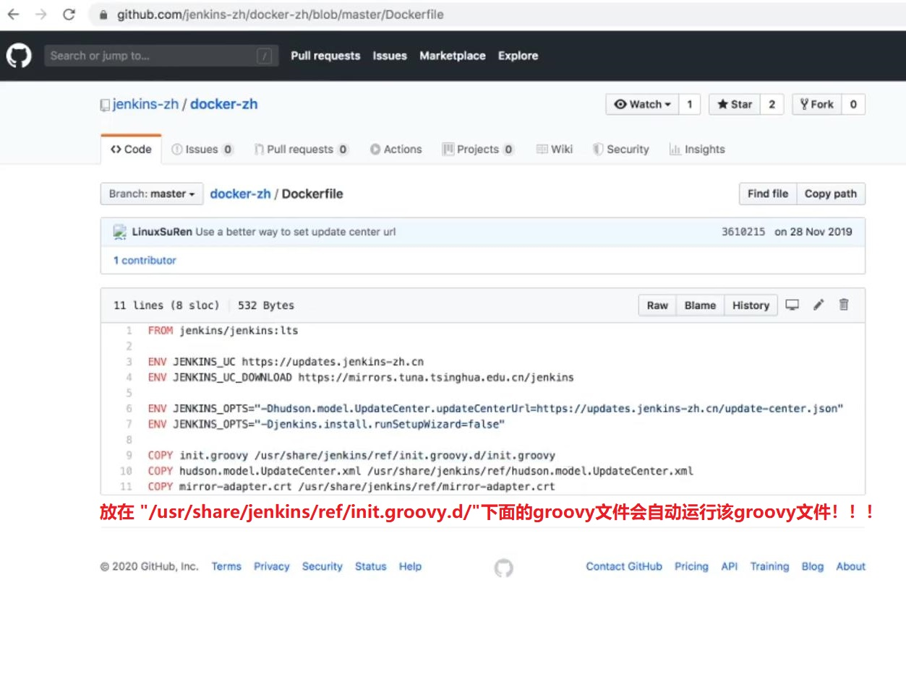
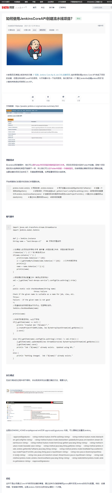
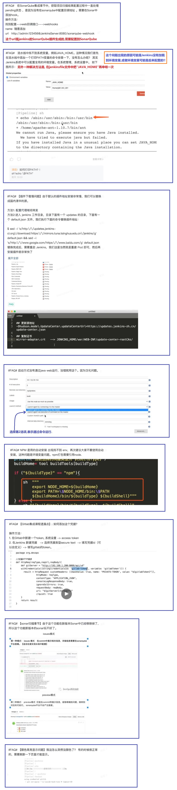

## 总结 ##
```
1. 使用nexus、Artifactory等制品仓库,引用公共的包和自己开发的包,要用分别管理

2. 常见的需求管理工具有jira、gitlab(也提供了需求管理的功能)、redmine、禅道 等

3. 使用Jenkins Hook,有以下缺点:
    (1) 当Jenkins维护的时候, Jenkins的hook衔接会失效
    (2) 当钱柜特别多的时候,可能会丢失请求,比如同时掉用三次Hook,可能只有两次生效。解决办法: 重新触发Hook或使用Jenkins的回访功能

4. Jenkins度量数据很有意义,在做devops评估的时候，一般需要一个度量平台,需要把各方面的的数据都收集出来.因为度量项目需要的一些数据

5.蓝绿发布和灰度发布
    蓝绿发布: 正在对外提供服务的老系统是绿色系统，新部署的系统是蓝色系统。蓝色系统不对外提供服务,用来做发布前测试,测试过程中发现任何问题,可以直接在蓝色系统上修改,不干扰用户正在使用的系统.
    灰度发布: 也叫金丝雀发布。是指在黑与白之间,能够平滑过渡的一种发布方式。AB test就是一种灰度发布方式，让一部分用户继续用A，一部分用户开始用B，如果用户对B没有什么反对意见，那么逐步扩大范围，把所有用户都迁移到B上面来。

6. Ansible Tower 发布项目: Ansible Tower是由Redhat提供的一个管理Ansible前端UI，使用它可以免费管理10台以内的主机，所以它是一个收费项目,该项目仅适用于那些不会运维开发,并且有钱的选手.
```

<br/><br/>

## Jenkins无状态化原理 ##
```
参考资料: https://blog.51cto.com/u_15127507/2656719
```
  



<br/><br/>

## FAQ ##

