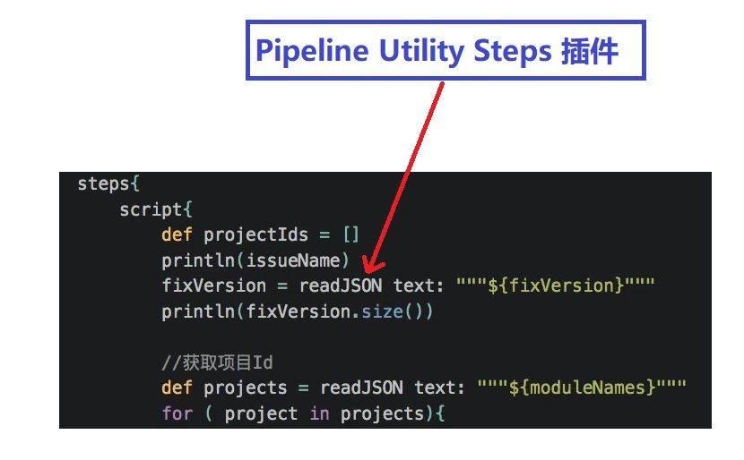
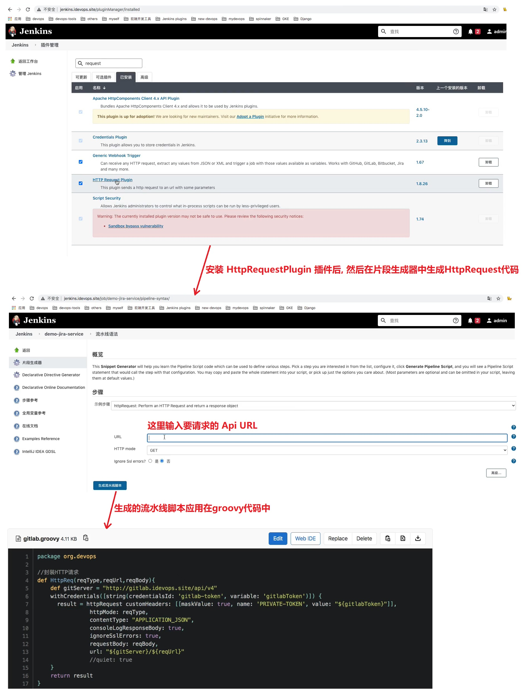
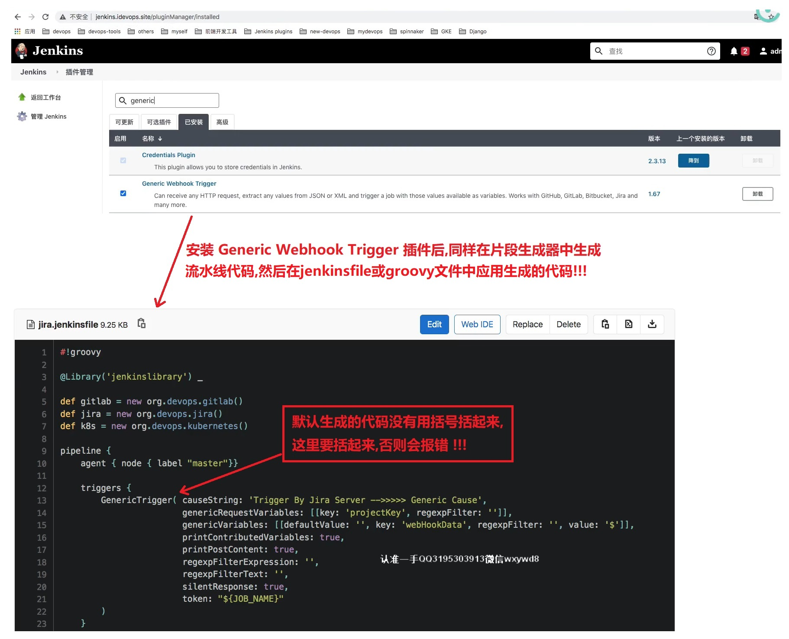
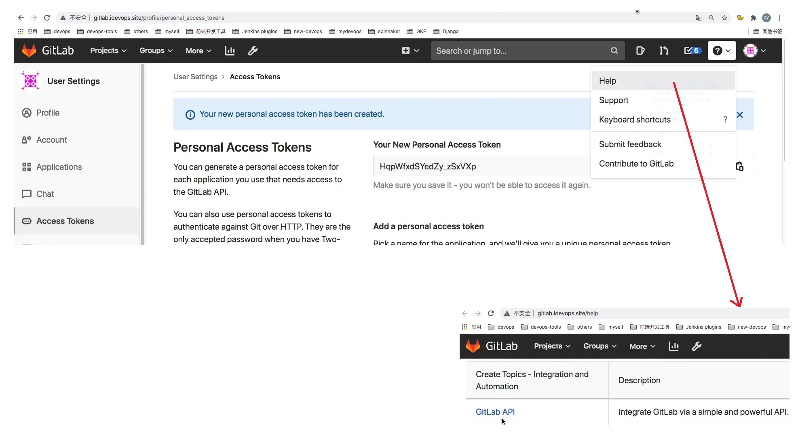

## 特性分支自动化实践 ##
```
Jenkins中插件:
    1. "Http Request Plugin" 支撑Jenkins调用其他API.
    2. "Generic Webhook Trigger" 实现通过API触发Jenkins构建.
    3. "Pipeline Utility Steps"实现"readJSON"和"writeJSON"方法. 参考资料: https://blog.csdn.net/u011541946/article/details/83833289
```

<br/><br/>

## Pipeline Utility Steps ##


<br/><br/>

## http request plugin ##


<br/><br/>

## Webhook trigger plugin ##


<br/><br/>

## GitLab Rest API DOC ##
