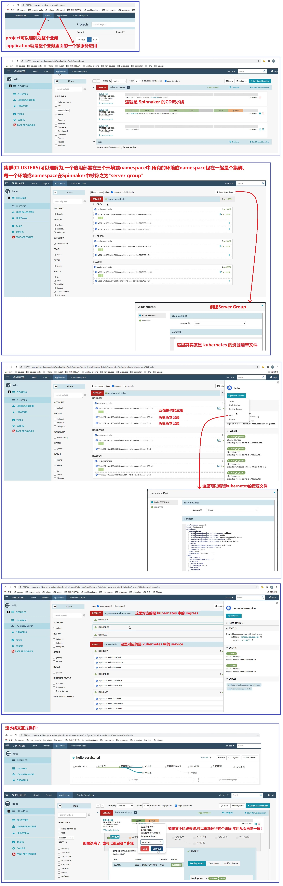
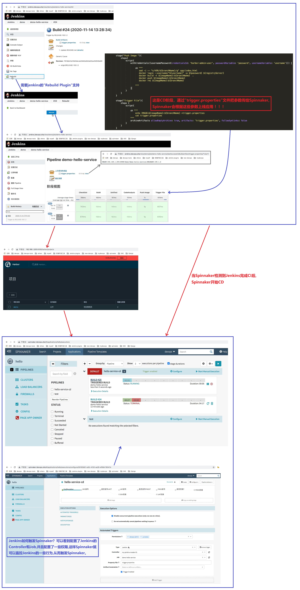
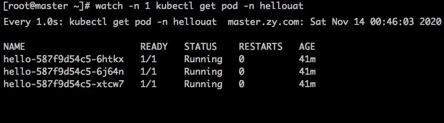

## 持续集成与持续部署实践 ##
```
Spinnaker 是一个应用管理和应用部署的工具,可以写流水线发布应用,pipeline也比较灵活,可以和任何系统做对接!

linux watch 命令表示每隔多少秒就运行一次命令:
    格式: 
        want -n [秒数] [命令]    
    如下示例表示每隔1秒就运行一次 kubectl 命令: 
        watch -n 1 kubectl get pod -n default

参考资料:
    在 Kubernetes 上使用 Spinnaker 构建部署管道: https://aws.amazon.com/cn/blogs/china/deployment-pipeline-spinnaker-kubernetes/
    spinnaker安装资源: https://github.com/zeyangli/spinnaker-cd-install
```

<br/><br/>

## 1. Spinnaker简单介绍 ##


<br/><br/>

## 2. Jenkins结合Spinnaker的CICD流程 ##


<br/><br/>

## 3. watch 命令的用法 ##

