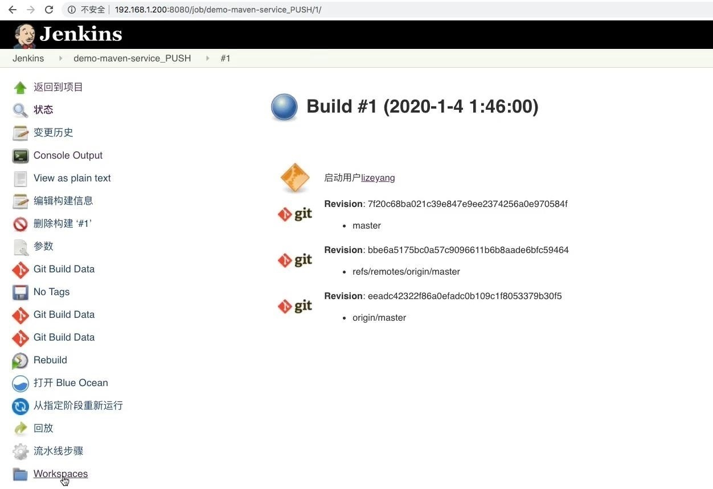
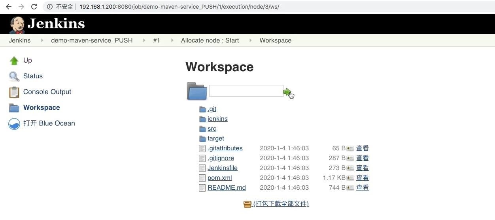
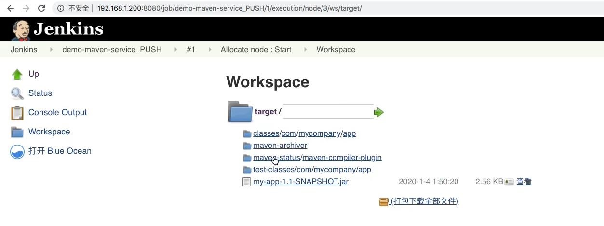

### 项目准备 ###
```
在 GitLab 准备一个 java maven 项目
Jenkins 脚本共享库
Jenkins pipeline 脚本
以上三个文件分别放在 GitLab 的三个仓库中
```

<br/>

### pipeline 脚本 ###
```
#!groovy

@Library('jenkinslibrary@master') _

// func from share library
def build = new org.devops.build()
def tools = new org.devops.tools()

// env
String buildType = "${env.buildType}"
String buildShell = "${env.buildShell}"


String srcUrl = "${env.srcUrl}"
String branchName = "${env.branchName}"

pipeline{
    agent{node {label "master"}}
    stages{
        
        stage("CheckOut"){
            steps{
                script{
                    tools.PrintMes("获取代码", "green")
                    // 下面的代码可以通过流水线语法生成
                    checkout([$class: 'GitSCM', branches: [[name: "${branchName}"]], doGenerateSubmoduleConfigurations: false, extensions: [], submoduleCfg: [], userRemoteConfigs: [[credentialsId: 'gitlab-admin-user', url: "${srcUrl}"]]])
                }
            }
        }

        stage("build"){
            steps{
                script{
                  tools.PrintMes("打包代码", "green")
                  build.Build(buildType, buildShell)
                }
            }
        }
    }
}
```

<br/>

### 在 Jenkins 的 WorkSpace 中查看下载的代码以及编译完成的包  ###


