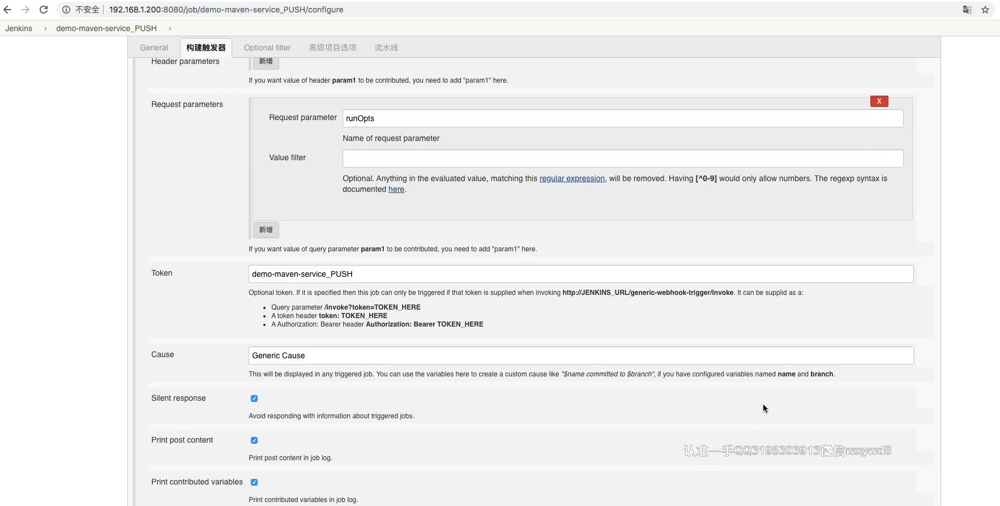
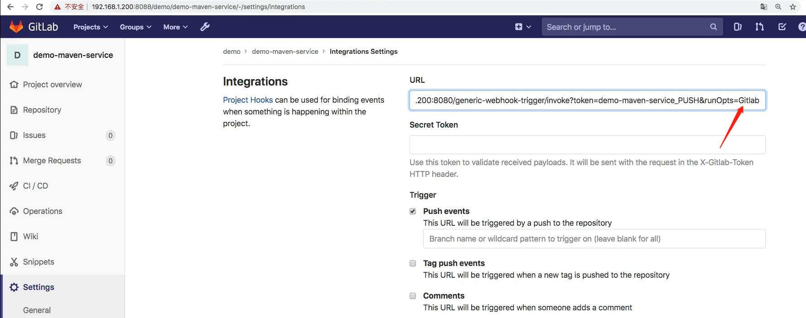
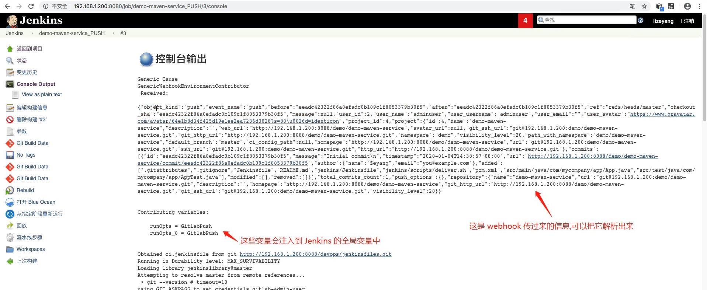
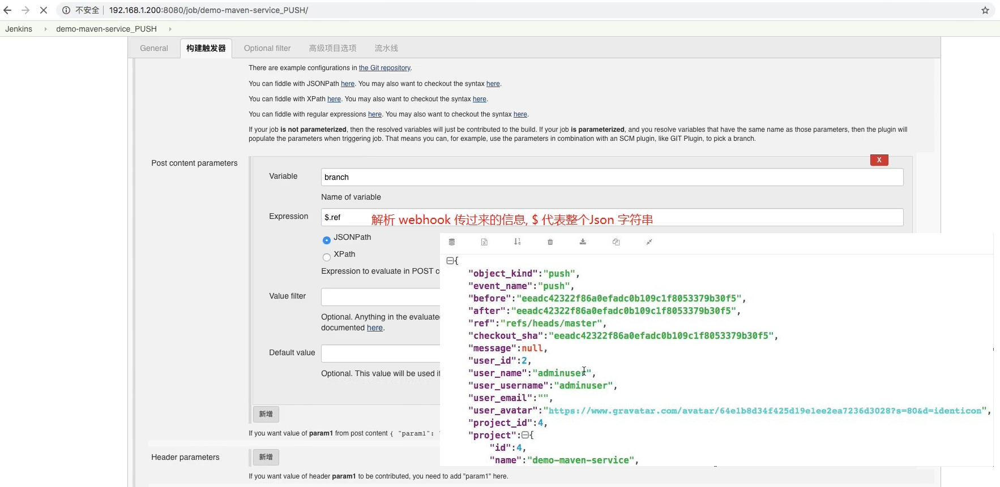

### 实现在哪个分支提交的代码,触发流水线后,就用提交了代码的这个分支去构建 ###

<br/>

### Jenkins 脚本 ###
```
#!groovy

@Library('jenkinslibrary@master') _

// func from share library
def build = new org.devops.build()
def tools = new org.devops.tools()

// env
String buildType = "${env.buildType}"
String buildShell = "${env.buildShell}"
String srcUrl = "${env.srcUrl}"

// 因为是通过解析  webhook 请求传过来的reqeust body 拿到, 所以不用把分支名配置到环境变量中
String branchName = ""

pipeline{
    agent{node {label "master"}}
    stages{
        
        stage("CheckOut"){
            steps{
                script{
                    
                    // runOpts 和 branch 变量都是在构建触发器中配置: runOpts 是 webhook 请求中的requestParameter; branch 是通过解析  webhook 请求传过来的reqeust body 拿到;  
                    if("${runOpts}" == "GitlabPush"){
                        branchName = branch - "refs/heads/"
                    }     
                    
                    println("${branchName}")

                    tools.PrintMes("获取代码", "green")
                    // 下面的代码可以通过流水线语法生成
                    checkout([$class: 'GitSCM', branches: [[name: "${branchName}"]], doGenerateSubmoduleConfigurations: false, extensions: [], submoduleCfg: [], userRemoteConfigs: [[credentialsId: 'gitlab-admin-user', url: "${srcUrl}"]]])
                }
            }
        }

        stage("build"){
            steps{
                script{
                  tools.PrintMes("打包代码", "green")
                  build.Build(buildType, buildShell)
                }
            }
        }
    }
}
```

<br/>

### 相关配置  ###



