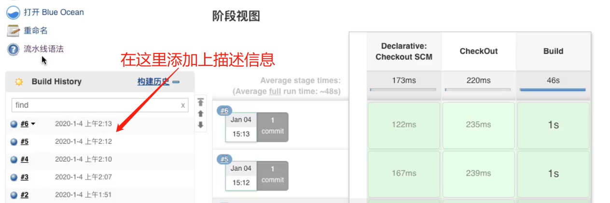
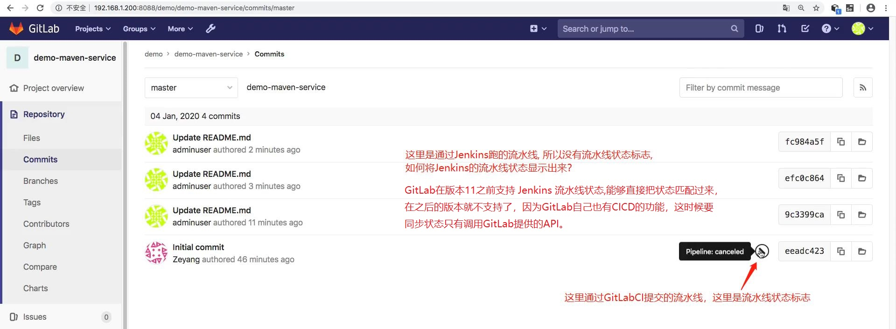

## 需求1. 给构建记录添加描述信息 ##
### 描述信息都可以通过 currentBuild 这个变量去获取。Jenkins的全局变量信息可以从"流水线语法 ==> 全局变量参考"中获取到 ### 


```
#!groovy

@Library('jenkinslibrary@master') _

// func from share library
def build = new org.devops.build()
def tools = new org.devops.tools()

// env
String buildType = "${env.buildType}"
String buildShell = "${env.buildShell}"
String srcUrl = "${env.srcUrl}"

// 因为是通过解析  webhook 请求传过来的reqeust body 拿到, 所以不用把分支名配置到环境变量中
String branchName = ""

// runOpts 和 branch 变量都是在构建触发器中配置: runOpts 是 webhook 请求中的requestParameter; branch 是通过解析  webhook 请求传过来的reqeust body 拿到;  
// userName 是通过解析  webhook 请求传过来的reqeust body 拿到;
if("${runOpts}" == "GitlabPush"){
    branchName = branch - "refs/heads/"
    currentBuild.description = "Trigger by ${userName} ${branch}"
}  

pipeline{
    agent{node {label "master"}}
    stages{
        
        stage("CheckOut"){
            steps{
                script{
                    println("${branchName}")

                    tools.PrintMes("获取代码", "green")
                    // 下面的代码可以通过流水线语法生成
                    checkout([$class: 'GitSCM', branches: [[name: "${branchName}"]], doGenerateSubmoduleConfigurations: false, extensions: [], submoduleCfg: [], userRemoteConfigs: [[credentialsId: 'gitlab-admin-user', url: "${srcUrl}"]]])
                }
            }
        }

        stage("build"){
            steps{
                script{
                  tools.PrintMes("打包代码", "green")
                  build.Build(buildType, buildShell)
                }
            }
        }
    }
}
```

<br/>
<br/>

## 需求2. 变更 GitLab 的提交状态 ##
### 在GitLab中, 有GitLabCI，用GitLabCI提交一次都会跑一个流水线,流水线成功就有一个标志。那么 GitLab 如何同步到 Jenkins 的 pipeline 状态 ###


```
#!groovy

@Library('jenkinslibrary@master') _

// func from share library
def build = new org.devops.build()
def tools = new org.devops.tools()
def gitlab = new org.devops.gitlab()

// env
String buildType = "${env.buildType}"
String buildShell = "${env.buildShell}"
String srcUrl = "${env.srcUrl}"

// 因为是通过解析 webhook 请求传过来的 reqeust body 拿到, 所以不用把分支名配置到环境变量中
// runOpts 是 webhook 请求中的requestParameter.
// branch、userName、projectId、commitSha 是通过解析  webhook 请求传过来的reqeust body 拿到;
String branchName = ""
if("${runOpts}" == "GitlabPush"){
    branchName = branch - "refs/heads/"
    
    currentBuild.description = "Trigger by ${userName} ${branch}"
    gitlab.ChangeCommitStatus(projectId,commitSha,"running")

    // 睡眠15秒, 便于观察效果
    // sleep 15
}  

pipeline{
    agent{node {label "master"}}
    stages{
        
        stage("CheckOut"){
            steps{
                script{
                    println("${branchName}")

                    tools.PrintMes("获取代码", "green")
                    // 下面的代码可以通过流水线语法生成
                    checkout([$class: 'GitSCM', branches: [[name: "${branchName}"]], doGenerateSubmoduleConfigurations: false, extensions: [], submoduleCfg: [], userRemoteConfigs: [[credentialsId: 'gitlab-admin-user', url: "${srcUrl}"]]])
                }
            }
        }

        stage("build"){
            steps{
                script{
                  tools.PrintMes("打包代码", "green")
                  build.Build(buildType, buildShell)
                }
            }
        }
    }

    post {
        always {
            script {
                println("always")
            }
        }

        success{
            script {
                println("success")
                gitlab.ChangeCommitStatus(projectId,commitSha,"success")
            }            
        }

        failure {
             script {
                println("failure")
                gitlab.ChangeCommitStatus(projectId,commitSha,"failed")
            }              
        }
        
        aborted {
              script {
                println("cancel")
                gitlab.ChangeCommitStatus(projectId,commitSha,"canceled")
            }             
        }
    }
}
```