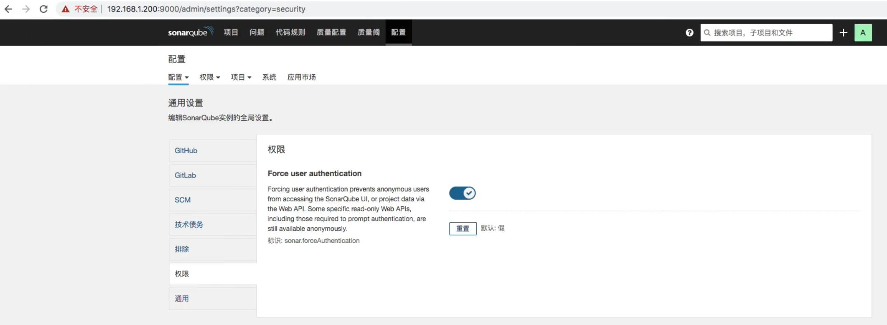

## sonarQube 可以有三种认证(这三种认证方式可以同时存在: ##
```
1.LDAP （需要安装插件实现）
2.GitHub和GitLab (配置实现)
3.sonar系统账号
4.sonarQube 的社区版不支持多分支, 比如设定用master分支做扫描,如果用其它分支做扫描,它也会当作是master分支. 解决方法: 对每个分支都建一个sonar项目
```

<br/>

## 注意事项: ## 
```
1.第一次进去是英文， 可以安装中文插件
2.开启强制认证后才有登录页面 
```
