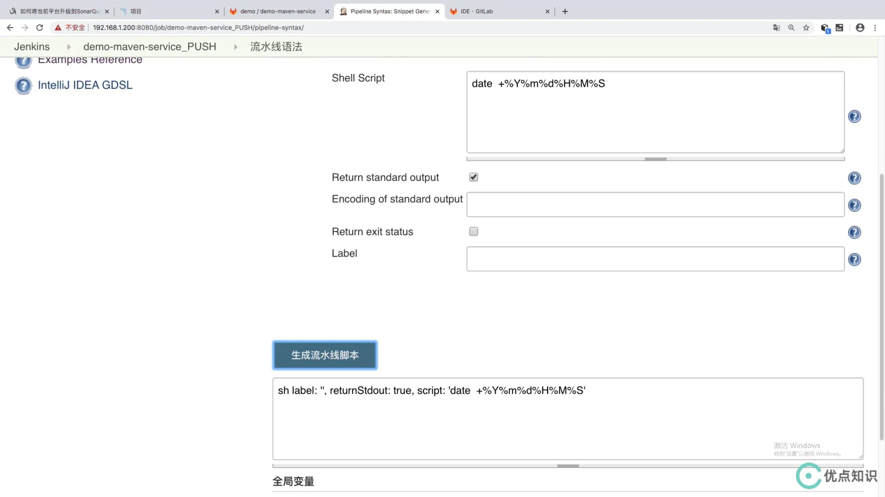

## 使用流水线进行自动化代码扫描的两种方式 : ##
```
1. 安装Jenkins插件做sonar扫描  
2. 直接写ShareLibrary, 本节使用这种方式
```

<br/>

### ShareLibrary --> sonarqube.groovy ### 
```
def SonarSacn(projectName,projectDesc,projectPath){
    def sonarServer = "http://192.168.1.200:9000"
    def sonarDate = sh returnStdout: true, script: 'date + %Y%m%d%H%M%S'
    sonarDate = sonarDate - "\n"

    def scannerHome = "/usr/local/sonar-scanner-3.2.0.1227-linux"

    sh  """
        ${scannerHome}/bin/sonar-scanner  -Dsonar.host.url=${sonarServer}  \
        -Dsonar.projectKey=${projectName}  \
        -Dsonar.projectName=${projectName}  \
        -Dsonar.projectVersion=${sonarDate} \
        -Dsonar.login=admin \
        -Dsonar.password=admin \
        -Dsonar.ws.timeout=30 \
        -Dsonar.projectDescription=${projectDesc}  \
        -Dsonar.links.homepage=http://www.baidu.com \
        -Dsonar.sources=${projectPath} \
        -Dsonar.sourceEncoding=UTF-8 \
        -Dsonar.java.binaries=target/classes \
        -Dsonar.java.test.binaries=target/test-classes \
        -Dsonar.java.surefire.report=target/surefire-reports
        """
}
```


<br/>

### Jenkins 脚本 ### 
```
#!groovy

@Library('jenkinslibrary@master') _

// func from share library
def build = new org.devops.build()
def tools = new org.devops.tools()
def gitlab = new org.devops.gitlab()
def toemail = new org.devops.toemail()
def sonarqube = new org.devops.sonarqube()

// env
String buildType = "${env.buildType}"
String buildShell = "${env.buildShell}"
String srcUrl = "${env.srcUrl}"

// 因为是通过解析 webhook 请求传过来的 reqeust body 拿到, 所以不用把分支名配置到环境变量中
// runOpts 是 webhook 请求中的requestParameter.
// branch、userName、projectId、commitSha 是通过解析  webhook 请求传过来的 reqeust body 拿到;
String branchName = ""
if("${runOpts}" == "GitlabPush"){
    branchName = branch - "refs/heads/"
    
    currentBuild.description = "Trigger by ${userName} ${branch}"
    gitlab.ChangeCommitStatus(projectId,commitSha,"running")

    // 睡眠15秒, 便于观察效果
    // sleep 15
}  

pipeline{
    agent{node {label "master"}}
    stages{
        
        stage("CheckOut"){
            steps{
                script{
                    println("${branchName}")

                    tools.PrintMes("获取代码", "green")
                    // 下面的代码可以通过流水线语法生成
                    checkout([$class: 'GitSCM', branches: [[name: "${branchName}"]], doGenerateSubmoduleConfigurations: false, extensions: [], submoduleCfg: [], userRemoteConfigs: [[credentialsId: 'gitlab-admin-user', url: "${srcUrl}"]]])
                }
            }
        }

        stage("build"){
            steps{
                script{
                  tools.PrintMes("打包代码", "green")
                  build.Build(buildType, buildShell)
                }
            }
        }

        stage("Sonar Qube Scan"){
            steps{
                script{
                  tools.PrintMes("代码扫描", "green")
                  sonarqube.SonarSacn(${JOB_NAME},${JOB_NAME},"src")
                }
            }
        }        
    }

    post {
        always {
            script {
                println("always")
            }
        }

        success{
            script {
                println("success")
                gitlab.ChangeCommitStatus(projectId,commitSha,"success")
                // userEmail 通过解析  webhook 请求传过来的reqeust body 拿到, 所以在 GitLab 账户要配置上 email
                toemail.Email("流水线成功", userEmail)
            }            
        }

        failure {
             script {
                println("failure")
                gitlab.ChangeCommitStatus(projectId,commitSha,"failed")
                toemail.Email("流水线失败", userEmail)
            }              
        }
        
        aborted {
              script {
                println("cancel")
                gitlab.ChangeCommitStatus(projectId,commitSha,"canceled")
                toemail.Email("流水线被取消", userEmail)
            }             
        }
    }
}
```


<br/>

### 获取时间戳的方式 ###
