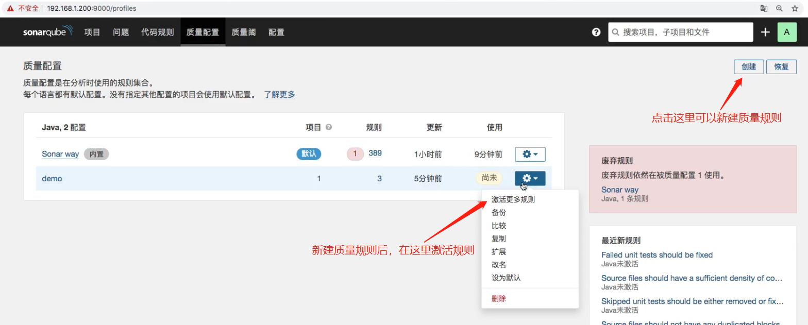
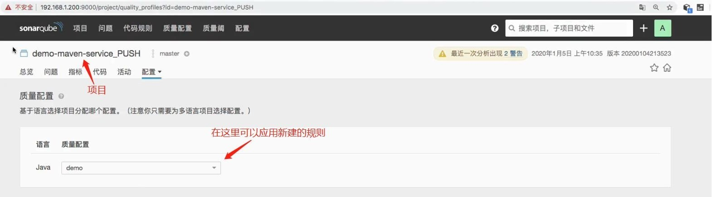
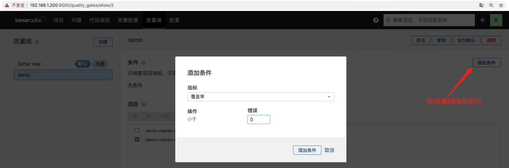
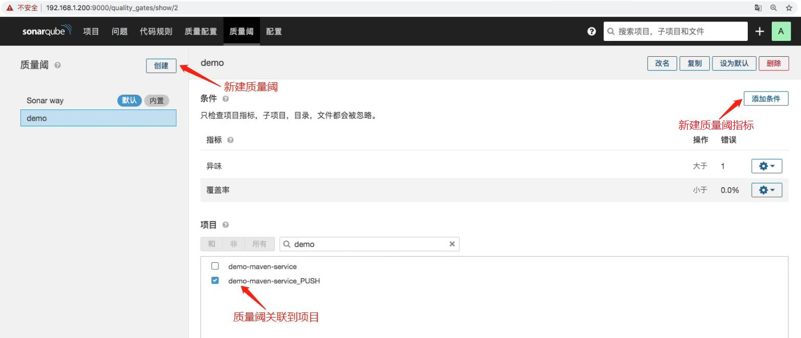

## 1. 新建质量规则. 注:新建的质量规则也可以设置为默认规则; 也可以使用 sonar api 改规则  ##



<br/><br/>

## 2. 新建质量阈(质量阈就是判断项目的各项有没有达到设定的指标). ##



<br/><br/>

## 3. 实现: sonar 扫描项目后不达标提醒, 但是首先要获取 sonar 扫描后的状态, 有以下两种获取方式: ##
### 3.1 在 Pipeline 中使用sonar插件提供的方式获取(这种方式有点问题,会长时间获取不到状态,然后一直停留在获取状态这步) ###
```
//ShareLibary -> sonarqube.groovy
//scan
def SonarSacnForJenkinsSonarPlugin(sonarServer,projectName,projectDesc,projectPath){
    // "sonarqube-test"和"sonarqube-prod" 是Jenkins 安装 SonarQube Scanner 插件后, 在"Jenkins --> 系统配置 --> SonarQube installations --> Name"的值
    def servers=["test":"sonarqube-test", "prod":"sonarqube-prod"]
    
    withSonarQubeEnv("${servers[sonarServer]}"){
        def sonarDate = sh returnStdout: true, script: 'date + %Y%m%d%H%M%S'
        sonarDate = sonarDate - "\n"
        
        def scannerHome = "/usr/local/sonar-scanner-3.2.0.1227-linux"
        sh  """
            ${scannerHome}/bin/sonar-scanner -Dsonar.projectKey=${projectName}  \
            -Dsonar.projectName=${projectName}  \
            -Dsonar.projectVersion=${sonarDate} \
            -Dsonar.ws.timeout=30 \
            -Dsonar.projectDescription=${projectDesc}  \
            -Dsonar.links.homepage=http://www.baidu.com \
            -Dsonar.sources=${projectPath} \
            -Dsonar.sourceEncoding=UTF-8 \
            -Dsonar.java.binaries=target/classes \
            -Dsonar.java.test.binaries=target/test-classes \
            -Dsonar.java.surefire.report=target/surefire-reports
            """
    }

   // 下面这种方式获取 sonar 状态有点问题
    def qg = waitForQualityGate()
    if (qg.status != 'OK'){
        error "Pipeline aborted due to quality gate failure: ${qg.status}"
    }
}
``` 

### 3.2 调用API获取(推荐) ###
```
//ShareLibary -> sonarapi.groovy

def HttpReq(reqType,reqUrl,reqBody){
    def sonarServer = "http://192.168.1.200:30090/api"
    
    // authentication: 'sonar-admin-user' 表示使用在 Jenkins 中配置的 sonar 凭证
    result = httpRequest authentication: 'sonar-admin-user',
            httpMode: reqType, 
            contentType: "APPLICATION_JSON",
            consoleLogResponseBody: true,
            ignoreSslErrors: true, 
            requestBody: reqBody,
            url: "${sonarServer}/${reqUrl}"
            //quiet: true
    
    return result
}


//获取Sonar质量阈状态
def GetProjectStatus(projectName){
    apiUrl = "project_branches/list?project=${projectName}"
    response = HttpReq("GET",apiUrl,'')
    
    response = readJSON text: """${response.content}"""
    result = response["branches"][0]["status"]["qualityGateStatus"]
    
    //println(response)
    
   return result
}
```

### pipeline 脚本 ###
```
#!groovy

@Library('jenkinslibrary@master') _

// func from share library
def build = new org.devops.build()
def tools = new org.devops.tools()
def gitlab = new org.devops.gitlab()
def toemail = new org.devops.toemail()
def sonarqube = new org.devops.sonarqube()
def sonarApi = new org.devops.sonarapi()

// env
String buildType = "${env.buildType}"
String buildShell = "${env.buildShell}"
String srcUrl = "${env.srcUrl}"

// 因为是通过解析 webhook 请求传过来的 reqeust body 拿到, 所以不用把分支名配置到环境变量中
// runOpts 是 webhook 请求中的requestParameter.
// branch、userName、projectId、commitSha 是通过解析  webhook 请求传过来的 reqeust body 拿到;
String branchName = ""
if("${runOpts}" == "GitlabPush"){
    branchName = branch - "refs/heads/"
    
    currentBuild.description = "Trigger by ${userName} ${branch}"
    gitlab.ChangeCommitStatus(projectId,commitSha,"running")

    // 睡眠15秒, 便于观察效果
    // sleep 15
}  

pipeline{
    agent{node {label "master"}}
    stages{
        
        stage("CheckOut"){
            steps{
                script{
                    println("${branchName}")

                    tools.PrintMes("获取代码", "green")
                    // 下面的代码可以通过流水线语法生成
                    checkout([$class: 'GitSCM', branches: [[name: "${branchName}"]], doGenerateSubmoduleConfigurations: false, extensions: [], submoduleCfg: [], userRemoteConfigs: [[credentialsId: 'gitlab-admin-user', url: "${srcUrl}"]]])
                }
            }
        }

        stage("build"){
            steps{
                script{
                  tools.PrintMes("打包代码", "green")
                  build.Build(buildType, buildShell)
                }
            }
        }

        stage("Sonar Qube Scan"){
            steps{
                script{
                  tools.PrintMes("代码扫描", "green")
                  sonarqube.SonarSacnForJenkinsSonarPlugin("test", ${JOB_NAME},${JOB_NAME},"src")
                  tools.PrintMes("获取扫描结果", "green")
                  result = sonarapi.GetProjectStatus("${JOB_NAME}")
                  println(result)

                  if(result.toString() == "ERROR"){
                    toemail.Email("代码质量阈错误!请及时修复!", userEmail)
                    error "代码质量阈错误!请及时修复!"
                  }else{
                    println(result)
                  }
                }
            }
        }        
    }

    post {
        always {
            script {
                println("always")
            }
        }

        success{
            script {
                println("success")
                gitlab.ChangeCommitStatus(projectId,commitSha,"success")
                // userEmail 通过解析  webhook 请求传过来的reqeust body 拿到, 所以在 GitLab 账户要配置上 email
                toemail.Email("流水线成功", userEmail)
            }            
        }

        failure {
             script {
                println("failure")
                gitlab.ChangeCommitStatus(projectId,commitSha,"failed")
                toemail.Email("流水线失败", userEmail)
            }              
        }
        
        aborted {
              script {
                println("cancel")
                gitlab.ChangeCommitStatus(projectId,commitSha,"canceled")
                toemail.Email("流水线被取消", userEmail)
            }             
        }
    }
}
```