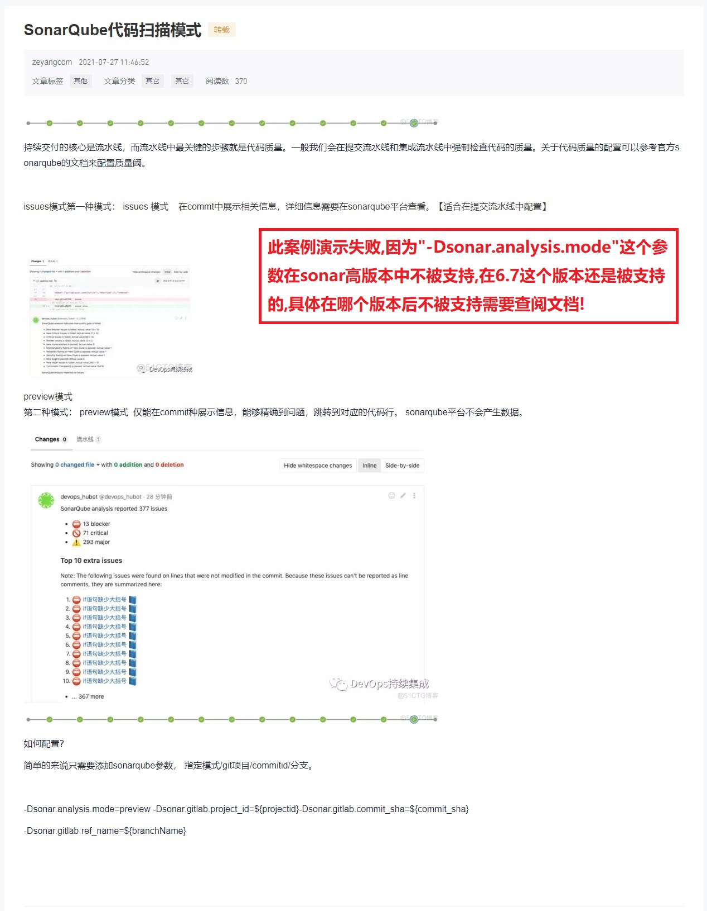

## 需求: 配置扫描结果与 Commit 关联 ##
```
参考资料: https://blog.51cto.com/devopsvip/3194478
此案例演示失败,因为"-Dsonar.analysis.mode"这个参数在sonar高版本中不被支持,在6.7这个版本还是被支持的,具体在哪个版本后不被支持需要查阅文档!
```


<br/><br/>

### gitlab.jenkinsfile ###
```
#!groovy

@Library('jenkinslibrary@master') _

// func from share library
def build = new org.devops.build()
def tools = new org.devops.tools()
def gitlab = new org.devops.gitlab()
def toemail = new org.devops.toemail()
def sonarqube = new org.devops.sonarqube()
def sonarApi = new org.devops.sonarapi()

// env
String buildType = "${env.buildType}"
String buildShell = "${env.buildShell}"
String srcUrl = "${env.srcUrl}"

// 因为是通过解析 webhook 请求传过来的 reqeust body 拿到, 所以不用把分支名配置到环境变量中
// branch、userName、projectId、commitSha 是通过解析  webhook 请求传过来的 reqeust body 拿到;
String branchName = "${env.branchName}"

branchName = branch - "refs/heads/"    
currentBuild.description = "Trigger by ${userName} ${branch}"
gitlab.ChangeCommitStatus(projectId,commitSha,"running")

// userEmail = "example@163.com"


pipeline{
    agent{node {label "master"}}
    stages{
        
        stage("CheckOut"){
            steps{
                script{
                    println("${branchName}")

                    tools.PrintMes("获取代码", "green")
                    // 下面的代码可以通过流水线语法生成
                    checkout([$class: 'GitSCM', branches: [[name: "${branchName}"]], doGenerateSubmoduleConfigurations: false, extensions: [], submoduleCfg: [], userRemoteConfigs: [[credentialsId: 'gitlab-admin-user', url: "${srcUrl}"]]])
                }
            }
        }

        stage("build"){
            steps{
                script{
                  tools.PrintMes("打包代码", "green")
                  build.Build(buildType, buildShell)
                }
            }
        }

        stage("Sonar Qube Scan"){
            steps{
                script{
                  
                  tools.PrintMes("搜索项目", "green")
                  result = sonarapi.SerarchProject(${JOB_NAME})
                  println(result)
                  if(result == "false"){
                    println("${JOB_NAME} ===>> 项目不存在,准备创建项目!")
                    sonarapi.CreateProject(${JOB_NAME})
                  }else{
                     println("${JOB_NAME} ===>> 项目已存在!")
                  }
                  
                  tools.PrintMes("配置项目质量规则", "green")
                  //qpName="${JOB_NAME}".split("-")[0]
                  // 更改项目质量规则
                  qpName = "Sonar%20way"
                  sonarapi.ConfigQualityProfiles("${JOB_NAME}","java",qpname)
                  
                  tools.PrintMes("配置质量阈", "green")
                  sonarapi.ConfigQualityGates("${JOB_NAME}",qpname)
                  
                  tools.PrintMes("代码扫描", "green")
                  sonarqube.SonarSacnForJenkinsSonarPlugin("test", "${JOB_NAME}","${JOB_NAME}","src","${runOpts}","${projectId}","${commitSha}","${branchName}")
                  
                  //*************************************************************************************//
                  // 扫描后获取到的结果和等待30秒获取的结果可能不一样,因为分析报告需要时间
                  // 这里的写法只是为了展示出效果

                  tools.PrintMes("获取扫描结果1", "green")
                  result = sonarapi.GetProjectStatus("${JOB_NAME}")
                  println(result)

                  // 等待30s再获取分析结果
                  sleep 30
                  
                  tools.PrintMes("获取扫描结果2", "green")
                  result = sonarapi.GetProjectStatus("${JOB_NAME}")
                  println(result)

                   //*************************************************************************************//

                  if(result.toString() == "ERROR"){
                    toemail.Email("代码质量阈错误!请及时修复!", userEmail)
                    error "代码质量阈错误!请及时修复!"
                  }else{
                    println(result)
                  }
                }
            }
        }        
    }

    post {
        always {
            script {
                println("always")
            }
        }

        success{
            script {
                println("success")
                gitlab.ChangeCommitStatus(projectId,commitSha,"success")
                // userEmail 通过解析  webhook 请求传过来的reqeust body 拿到, 所以在 GitLab 账户要配置上 email
                toemail.Email("流水线成功", userEmail)
            }            
        }

        failure {
             script {
                println("failure")
                gitlab.ChangeCommitStatus(projectId,commitSha,"failed")
                toemail.Email("流水线失败", userEmail)
            }              
        }
        
        aborted {
              script {
                println("cancel")
                gitlab.ChangeCommitStatus(projectId,commitSha,"canceled")
                toemail.Email("流水线被取消", userEmail)
            }             
        }
    }
}
```

<br/><br/>

### ShareLibray --> sonarqube.groovy ###
```
def SonarSacnForJenkinsSonarPlugin(sonarServer,projectName,projectDesc,projectPath,runOpts='',projectId='',commitSha='',branchName=''){
    // "sonarqube-test"和"sonarqube-prod" 是Jenkins 安装 SonarQube Scanner 插件后, 在"Jenkins --> 系统配置 --> SonarQube installations --> Name"的值
    def servers=["test":"sonarqube-test", "prod":"sonarqube-prod"]
    
    withSonarQubeEnv("${servers[sonarServer]}"){
        def sonarDate = sh returnStdout: true, script: 'date + %Y%m%d%H%M%S'
        sonarDate = sonarDate - "\n"
        
        def scannerHome = "/usr/local/sonar-scanner-3.2.0.1227-linux"

        if(runOpts == "GitlabPush"){
            sh  """
                ${scannerHome}/bin/sonar-scanner -Dsonar.projectKey=${projectName}  \
                -Dsonar.projectName=${projectName}  \
                -Dsonar.projectVersion=${sonarDate} \
                -Dsonar.ws.timeout=30 \
                -Dsonar.projectDescription=${projectDesc}  \
                -Dsonar.links.homepage=http://www.baidu.com \
                -Dsonar.sources=${projectPath} \
                -Dsonar.sourceEncoding=UTF-8 \
                -Dsonar.java.binaries=target/classes \
                -Dsonar.java.test.binaries=target/test-classes \
                -Dsonar.java.surefire.report=target/surefire-reports \
                -Dsonar.analysis.mode=preview -Dsonar.gitlab.project_id=${projectId} -Dsonar.gitlab.commit_sha=${commitSha} \
                -Dsonar.gitlab.ref_name=${branchName}
                """
        }else{
            sh  """
                ${scannerHome}/bin/sonar-scanner -Dsonar.projectKey=${projectName}  \
                -Dsonar.projectName=${projectName}  \
                -Dsonar.projectVersion=${sonarDate} \
                -Dsonar.ws.timeout=30 \
                -Dsonar.projectDescription=${projectDesc}  \
                -Dsonar.links.homepage=http://www.baidu.com \
                -Dsonar.sources=${projectPath} \
                -Dsonar.sourceEncoding=UTF-8 \
                -Dsonar.java.binaries=target/classes \
                -Dsonar.java.test.binaries=target/test-classes \
                -Dsonar.java.surefire.report=target/surefire-reports
                """
        }
    }


   // 下面这种方式获取 sonar 状态有点问题
   // def  qg = waitForQualityGate()
   // if (qg.status != 'OK'){
   //     error "Pipeline aborted due to quality gate failure: ${qg.status}"
   // }
}
```
