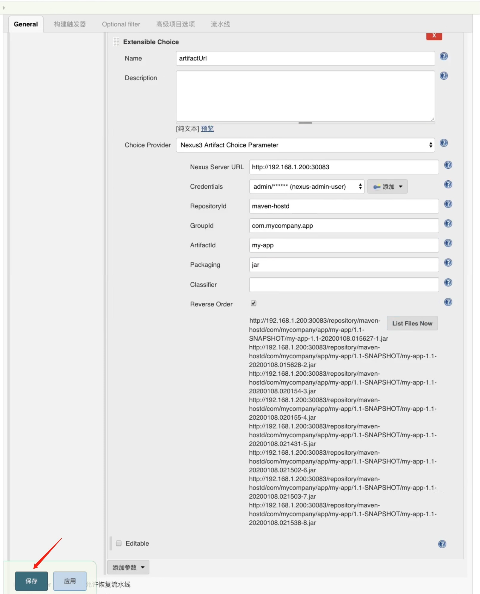
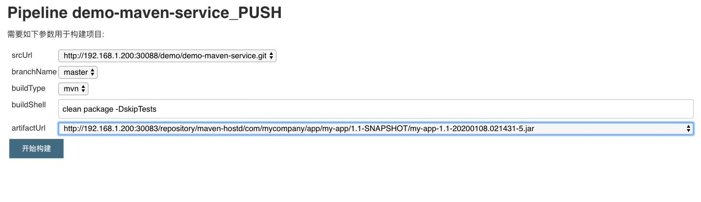

## Nexus 制品发布 ##
```
步骤:
    a. Jenkins中安装"Maven Artifact ChoiceListProvider(Nexus)"插件
    b. 在任务的"参数化构建",添加参数下拉菜单选择"Extensible Choice", 在"Choice Provider"中选择"Nexus3 Artifact Choice Parameter", 然后再弹出的页面中配置相关参数.
    c. 开启流水上发布制品(就是把包发布到应用服务器)
```



<br/>

### gitlab.jenkinsfile 使用共享库上传制品 ###
```
#!groovy

@Library('jenkinslibrary@master') _

// func from share library
def build = new org.devops.build()
def tools = new org.devops.tools()
def gitlab = new org.devops.gitlab()
def nexus = new org.devops.nexus()

// env
String buildType = "${env.buildType}"
String buildShell = "${env.buildShell}"
String srcUrl = "${env.srcUrl}"
String artifactUrl = "${env.artifactUrl}"

// branch 是通过解析 gitlab 的 webhook 请求传过来的 reqeust body 拿到;
String branchName = branch - "refs/heads/"
currentBuild.description = "Trigger by ${userName} ${branch}"
gitlab.ChangeCommitStatus(projectId,commitSha,"running")

pipeline{
    agent{node {label "master"}}
    stages{
        
        stage("CheckOut"){
            steps{
                script{
                    println("${branchName}")

                    tools.PrintMes("获取代码", "green")
                    // 下面的代码可以通过流水线语法生成
                    checkout([$class: 'GitSCM', branches: [[name: "${branchName}"]], doGenerateSubmoduleConfigurations: false, extensions: [], submoduleCfg: [], userRemoteConfigs: [[credentialsId: 'gitlab-admin-user', url: "${srcUrl}"]]])
                }
            }
        }

        stage("build"){
            steps{
                script{
                    tools.PrintMes("打包代码", "green")
                    build.Build(buildType, buildShell)

                    // 上传制品
                    //nexus.main("maven")
                    nexus.main("nexus")

                    // 发布制品(就是把包发布到应用服务器),这里的思路是下载制品到本地,再把本地的制品上传到应用服务器.简单的方式是直接让应用服务器拉取要发布的制品.
                    sh "wget ${artifactUrl} && ls"
                }
            }
        }      
    }
}
```