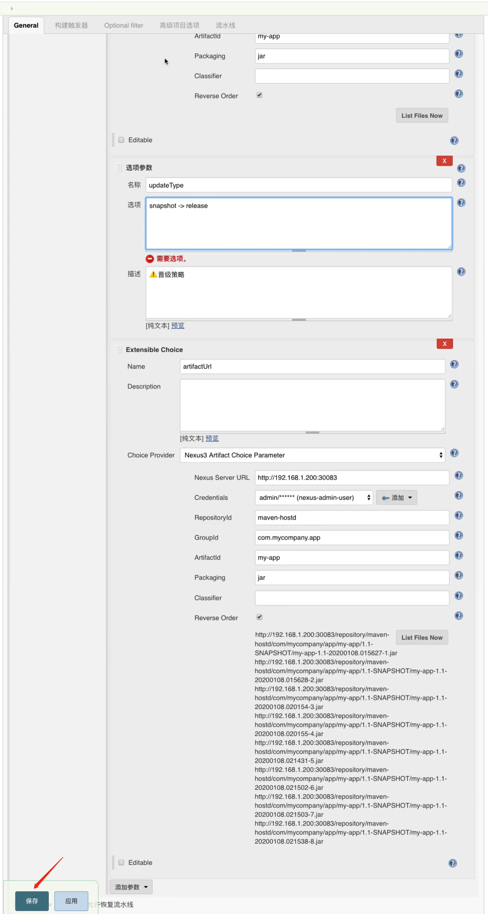
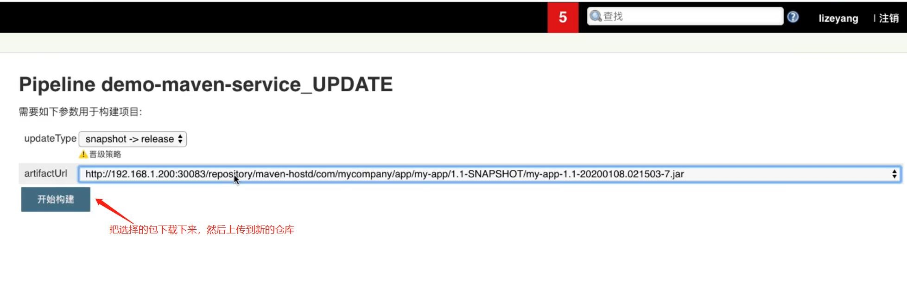

## Nexus 制品晋级 ##
```
(1) 制品晋级就是把 snapshot 版本升级为 release 版本(晋级的目的是dev环境的包在生产环境也能运行, 可能还需要通过参数化配置才能实现一个版本在各个环境都能运行).
(2) 制品晋级的两种方式:
        2.1 修改POM文件,然后打包上传到release仓库,这种方式会重新打包.
        2.2 把打好的包下载下来,改版本号,传到release仓库
(3) 示例步骤
        3.1 Jenkins中安装"Maven Artifact ChoiceListProvider(Nexus)"插件
	    3.2 在 jenkins 新建流水线并配置相关参数
	    3.3 下载包,改版本号,然后上传到release仓库
```



<br/>

### update.jenkinsfile ###
```
#!groovy

@Library('jenkinslibrary@master') _

def nexus = new org.devops.nexus()

String updateType = "${env.updateType}"
String artifactUrl = "${env.artifactUrl}"

pipeline{
    agent{
        node{
            label "build"
        }
    }

    stages{
        stage("UpdateArtifact"){
            steps{
                script{
                    nexus.ArtifactUpdate(updateType, artifactUrl)
                }
            }
        }
    }
}
```

<br/>

### nexus.groovy ###
```
// 制品晋级
def ArtifactUpdate(updateType, artifactUrl) {
    // 晋级策略
    if("${updateType}" == "snapshot -> release"){
        println("snapshot -> release")
        
        // 下载原始制品
        sh "rm -rf updates && mkdir updates && cd updates && wget ${artifactUrl} && ls -l"
        
        // 获取ArtifactID
        artifactUrl = artifactUrl - "http://192.168.1.200:30083/repository/maven-hostd/"
        artifactUrl = artifactUrl.split("/").toList()
        println(artifactUrl.size())

        env.jarName = artifactUrl[-1]
        env.pomVersion = artifactUrl[-2].replace("SNAPSHOT","RELEASE")
        env.pomArtifact = artifactUrl[-3]
        env.pomPackaging = artifactUrl[-1].split("\\.").toList()[-1][-1]
        env.pomGroupId = artifactUrl[0..-4].join(".")

        println("${pomGroupId}-${pomArtifact}-${pomVersion}-${pomPackaging}")
        
        env.newJarName = "${pomArtifact}-${pomVersion}.${pomPackaging}"
        // 更改名称
        sh "cd updates && mv ${jarName} ${newJarName}"

        // 上传制品
        env.repoName = "maven-release"
        env.filePath = "updates/${newJarName}"

        NexusUpload()
    }
}
```