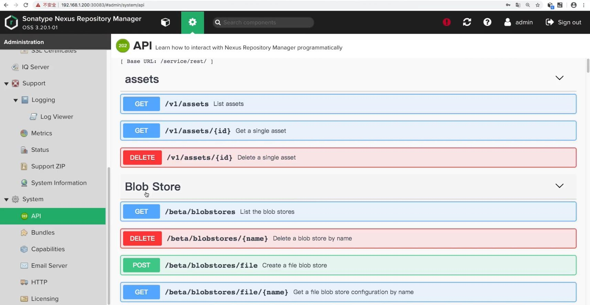
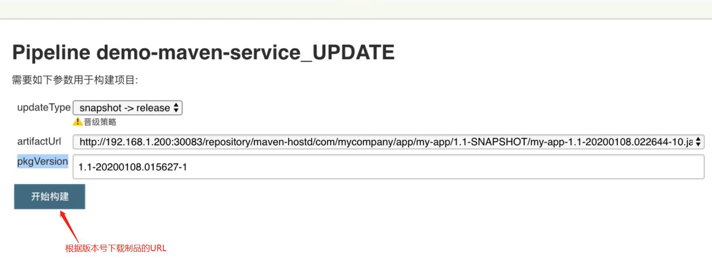

## Nexus REST API ##


<br/><br/>

## 需求 ##


<br/>

### update.jenkinsfile ###
```
#!groovy

@Library('jenkinslibrary@master') _

def nexus = new org.devops.nexus()
def nexusapi = new org.devops.nexusapi()

String updateType = "${env.updateType}"
String artifactUrl = "${env.artifactUrl}"
String pkgVersion = "${env,pkgVersion}"

pipeline{
    agent{
        node{
            label "build"
        }
    }

    stages{
        stage("UpdateArtifact"){
            steps{
                script{
                    //nexus.ArtifactUpdate(updateType, artifactUrl)
                    //nexusapi.GetRepoComponents("maven-hostd")
                    nexusapi.GetSingleComponents("maven-hostd","com.mycompany.app","myapp",pkgVersion) 
                }
            }
        }
    }
}
```

<br/>

### ShareLibrary --> sonarapi.groovy ###
```
package org.devops


//封装HTTP
def HttpReq(reqType,reqUrl,reqBody){
    def sonarServer = "http://192.168.1.200:30090/api"
    
    // authentication: 'sonar-admin-user' 表示使用在 Jenkins 中配置的 sonar 凭证
    result = httpRequest authentication: 'sonar-admin-user',
            httpMode: reqType, 
            contentType: "APPLICATION_JSON",
            consoleLogResponseBody: true,
            ignoreSslErrors: true, 
            requestBody: reqBody,
            url: "${sonarServer}/${reqUrl}"
            //quiet: true
    
    return result
}


//获取Sonar质量阈状态
def GetProjectStatus(projectName){
    apiUrl = "project_branches/list?project=${projectName}"
    response = HttpReq("GET",apiUrl,'')
    
    response = readJSON text: """${response.content}"""
    result = response["branches"][0]["status"]["qualityGateStatus"]
    
    //println(response)
    
   return result
}


//搜索Sonar项目
def SerarchProject(projectName){
    apiUrl = "projects/search?projects=${projectName}"
    response = HttpReq("GET",apiUrl,'')

    response = readJSON text: """${response.content}"""
    result = response["paging"]["total"]

    if(result.toString() == "0"){
       return "false"
    } else {
       return "true"
    }
}


//创建Sonar项目
def CreateProject(projectName){
    apiUrl =  "projects/create?name=${projectName}&project=${projectName}"
    response = HttpReq("POST",apiUrl,'')
    println(response)
}


//配置项目质量规则
def ConfigQualityProfiles(projectName,lang,qpname){
    apiUrl = "qualityprofiles/add_project?language=${lang}&project=${projectName}&qualityProfile=${qpname}"
    response = HttpReq("POST",apiUrl,'')
    println(response)
}


//获取质量阈ID
def GetQualtyGateId(gateName){
    apiUrl= "qualitygates/show?name=${gateName}"
    response = HttpReq("GET",apiUrl,'')
    response = readJSON text: """${response.content}"""
    result = response["id"]
    
    return result
}


//配置项目质量阈
def ConfigQualityGates(projectName,gateName){
    gateId = GetQualtyGateId(gateName)
    apiUrl = "qualitygates/select?gateId=${gateId}&projectKey=${projectName}"
    response = HttpReq("POST",apiUrl,'')
    println(response)println(response)
}
```