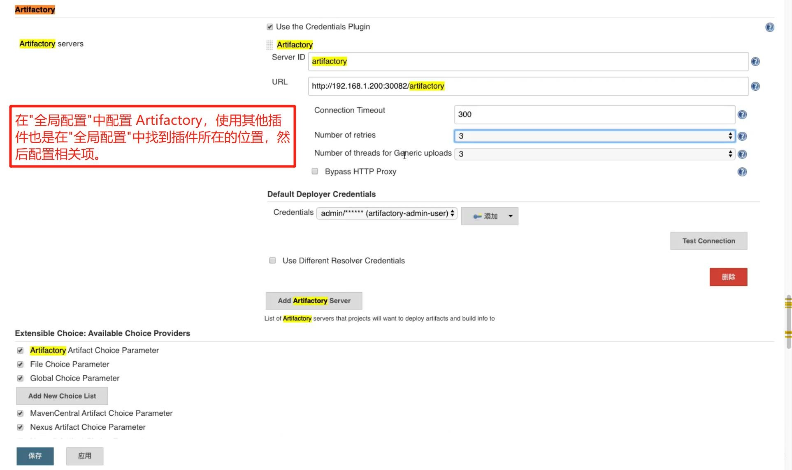
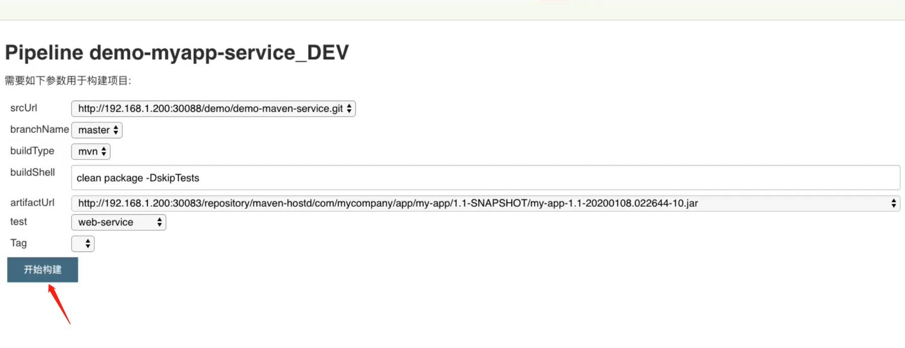

## 使用 Artifactory 构建收集数据- ##
```
(1) Artifactory 有开源版本和企业版本. Artifactory的功能比较强大, 能够收集数据(元数据、信息等).
(2) Artifactory 除了用做发布之外, 还可以使用 Artifactory 构建项目, 用 Artifactory 构建项目会把构建数据展示在 Artifactory 页面.
(3) Artifactory 的构建功能要通过插件"Artifactory Plugin"实现, 所以需要在Jenkins中安装"Artifactory Plugin"插件.
(4) 扩展资料:
    Groovy - GString & String:  https://blog.csdn.net/Dream_Weave/article/details/106387217
    groovy入门-GString: https://blog.csdn.net/lsk_shah/article/details/117021812
    Jenkins 视图: https://blog.csdn.net/qq_42606357/article/details/119879066
```




<br/><br/>

### jenkinsfile ###
```
#!groovy

@Library('jenkinslibrary@master') _

// func from share library
def build = new org.devops.build()
def tools = new org.devops.tools()
def gitlab = new org.devops.gitlab()
def nexus = new org.devops.nexus()
def artifactory = new org.devops.artifactory()

// env
String buildType = "${env.buildType}"
String buildShell = "${env.buildShell}"
String srcUrl = "${env.srcUrl}"
String artifactUrl = "${env.artifactUrl}"

// branch 是通过解析 gitlab 的 webhook 请求传过来的 reqeust body 拿到;
String branchName = branch - "refs/heads/"
currentBuild.description = "Trigger by ${userName} ${branch}"
gitlab.ChangeCommitStatus(projectId,commitSha,"running")

pipeline{
    agent{node {label "master"}}
    stages{
        
        stage("CheckOut"){
            steps{
                script{
                    println("${branchName}")

                    tools.PrintMes("获取代码", "green")
                    // 下面的代码可以通过流水线语法生成
                    checkout([$class: 'GitSCM', branches: [[name: "${branchName}"]], doGenerateSubmoduleConfigurations: false, extensions: [], submoduleCfg: [], userRemoteConfigs: [[credentialsId: 'gitlab-admin-user', url: "${srcUrl}"]]])
                }
            }
        }

        stage("build"){
            steps{
                script{
                    tools.PrintMes("打包代码", "green")
                    artifactory.main(buildType, buildShell)
                }
            }
        }      
    }
}
```

<br/><br/>

### ShareLibrary --> artifactory.groovy ###
```
//Maven打包构建
def MavenBuild(buildShell){
    def server = Artifactory.newServer url: "http://192.168.1.200:30082/artifactory"
    def rtMaven = Artifactory.newMavenBuild()
    def buildInfo
    server.connection.timeout = 300
    server.credentialsId = 'artifactory-admin-user' 
    //maven打包
    rtMaven.tool = 'M2' 
    buildInfo = Artifactory.newBuildInfo()

    String newBuildShell = "${buildShell}".toString()
    println(newBuildShell)
    rtMaven.run pom: 'pom.xml', goals: newBuildShell, buildInfo: buildInfo
    //上传build信息
    server.publishBuildInfo buildInfo
}

def main(buildType,buildShell){
    if(buildType == "mvn"){
        MavenBuild(buildShell)
    }
}
```