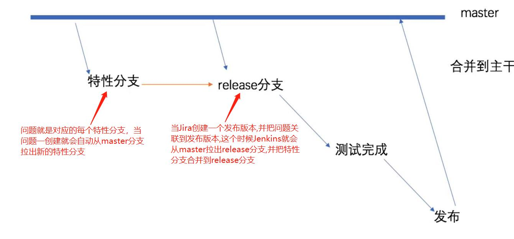
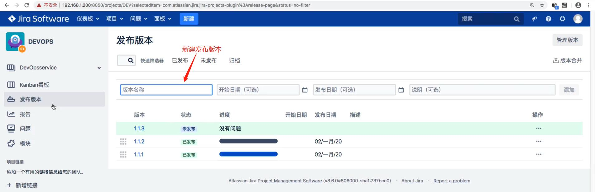
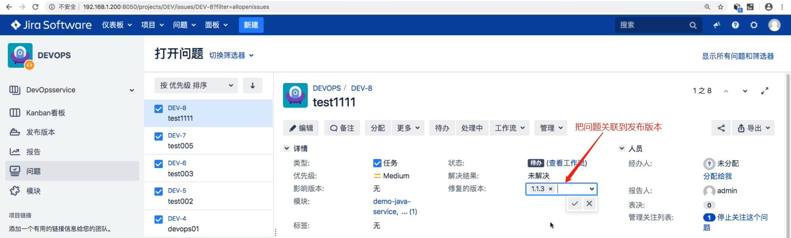

## Jira 自动创建 Gitlab 合并请求 ##
```
1. Jira 创建问题 --> 调用Jenkins的hook, 在Jenkins脚本中会触发"问题创建"事件(issue_created) --> Jenkins 调用 GitLab API --> 创建特性分支. 可以看出Jira问题对应的就是特性分支. 
2. Jira 创建一个发布版本后,会触发"创建发布版本"事件(version_created) ==> 创建release分支
3. 当问题解决后, 把问题关联到发布版本, 会触发"问题更新"事件(jira:issue_updated) ==> 合并feature分支到release分支
3. 最后发布版本, 会触发"发布版本"事件(version_released) ==> 删除特性分支
```

<br/><br/>


