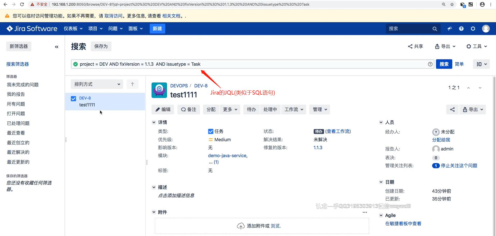

## 自动清理已合并的特性分支 ##
```
Jira release 发布后自动清理分支: release发布 --> Jenkins --> 清理Gitlab分支(已合并的特性分支)
```

<br/><br/>

### jira.jenkinsfile ### 
```
@Library('jenkinslibrary') _

def gitlab = new org.devops.gitlab()
def jira = new org.devops.jira()

pipeline {
    agent { node { label "master"}}


    stages{

        stage("FileterData"){
            steps{
                script{
                    response = readJSON text: """${webHookData}"""

                    println(response)

                    env.eventType = response["webhookEvent"]

                    switch(eventType) {
                        case "jira:version_created":
                            env.versionName = response['version']['name']
                            currentBuild.description = "Trigger by ${eventType} ${versionName}"
                            break                        
                        case "jira:issue_created":
                            env.issueName = response['issue']['key']
                            env.userName = response['user']['name']
                            env.moduleNames = response['issue']['fields']['components']
                            env.fixVersion = response['issue']['fields']['fixVersions']
                            currentBuild.description = " Trigger by ${userName} ${eventType} ${issueName} "
                            break

                        case "jira:issue_updated":
                            env.issueName = response['issue']['key']
                            env.userName = response['user']['name']
                            env.moduleNames = response['issue']['fields']['components']
                            env.fixVersion = response['issue']['fields']['fixVersions']
                            currentBuild.description = " Trigger by ${userName} ${eventType} ${issueName} "
                            break
                        case "jira:version_released":
                            env.versionName = response['version']['name']
                            currentBuild.description = "Trigger by ${eventType} ${versionName}"
                            break  
                        default:
                            println("hello")
                    }
                }
            }
        }

        stage("DeleteBranch"){
            when{
                environment name: 'eventType', value: 'jira:version_released'
            }
            
            steps{
                // 获取issueName
                println("project%20%3D%20${projectKey}%20AND%20fixVersion%20%3D%20${versionName}%20AND%20issuetype%20%3D%20Task")
                // 根据Jira的JQL语句查询
                response = jira.RunJql(project%20%3D%20${projectKey}%20AND%20fixVersion%20%3D%20${versionName}%20AND%20issuetype%20%3D%20Task)
                
                response = readJSON text: """${response.content}"""
                println(response)
                issues = [:]
                for (issue in response['issues']){
                    println(issue["key"])
                    println(issue["fields"]["components"])
                    issues[issue["key"]] = []

                    // 获取issue关联的模块
                    for(component in issue[fields]["components"]){
                        issue[issue["key"]].add(component["name"])
                    }
                }

                println(issues)

                // 搜索gitlab分支是否已合并然后删除
                for (issue in issues.keySet()){
                    for (projectName in issues[issue]){
                        repoName = projectName.split("-")[0]
                        projectId = gitlab.GetProjectID(repoName, projectName)
                        response = gitlab.SearchProjectBranches(projectId, issue)
                        println(response[projectId][0]["merged"])

                        if(response[projectId][0]["merged"] == false){
                            println("${projectName}" --> ${issue} --> 此分支未合并暂时忽略!")
                        }else{
                            println("${projectName}" --> ${issue} --> 此分支已合并准备忽略!")
                            gitlab.DeleteBranch(projectId, issue)
                        }
                    }
                }
            }
        }

        stage("CreateBranchOrMR"){
            
            // 只有当 eventType 的值为 'jira:issue_created' 或 'jira:issue_updated' 才能运行这个阶段, "anyOf"表示两者之中的一个就可以
            when {
                anyOf {
                    environment name: 'eventType', value: 'jira:issue_created'   //issue 创建 /更新
                    environment name: 'eventType', value: 'jira:issue_updated' 
                }
            }

            steps{
                script{
                    def projectIds = []
                    println(issueName)
                    fixVersion = readJSON text: """${fixVersion}"""
                    println(fixVersion.size())

                    //获取项目Id
                    def projects = readJSON text: """${moduleNames}"""
                    for ( project in projects){
                        println(project["name"])
                        projectName = project["name"]
                        currentBuild.description += "\n project: ${projectName}"
                        repoName = projectName.split("-")[0]
                        
                        try {
                            projectId = gitlab.GetProjectID(repoName, projectName)
                            println(projectId)
                            projectIds.add(projectId)   
                        } catch(e){
                            println(e)
                            println("未获取到项目ID，请检查模块名称！")
                        }
                    } 

                    println(projectIds)  


                    if (fixVersion.size() == 0) {
                        for (id in projectIds){
                            println("新建特性分支--> ${id} --> ${issueName}")
                            currentBuild.description += "\n 新建特性分支--> ${id} --> ${issueName}"
                            gitlab.CreateBranch(id,"master","${issueName}")
                        }
                            
                        

                    } else {
                        fixVersion = fixVersion[0]['name']
                        println("Issue关联release操作,Jenkins创建合并请求")
                        currentBuild.description += "\n Issue关联release操作,Jenkins创建合并请求 \n ${issueName} --> RELEASE-${fixVersion}" 
                        
                        for (id in projectIds){

                            println("创建RELEASE-->${id} -->${fixVersion}分支")
                            gitlab.CreateBranch(id,"master","RELEASE-${fixVersion}")


                            
                            println("创建合并请求 ${issueName} ---> RELEASE-${fixVersion}")
                            gitlab.CreateMr(id,"${issueName}","RELEASE-${fixVersion}","${issueName}--->RELEASE-${fixVersion}")
                            
                        }
                    } 
                }
            }
        }
    }
}
```

<br/><br/>

