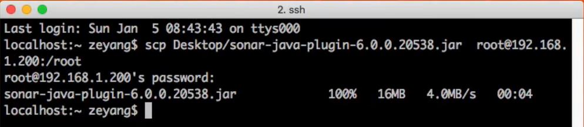
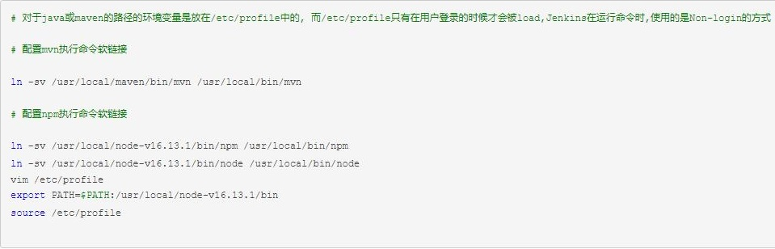
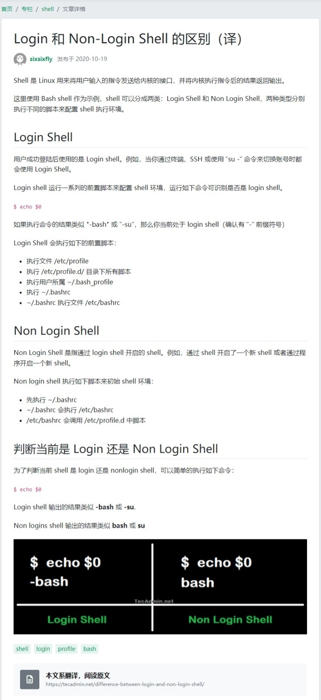

### 参考文档 ###
```
groovy: http://www.groovy-lang.org/syntax.html
云计算技术与应用学习教程: http://c.biancheng.net/cloud_computing/
GitHubPages: https://pages.github.com
```

&nbsp;
### MD格式文档语法 ###
```
https://www.jianshu.com/p/f378e3f2e7e1
https://blog.csdn.net/danxiaodeshitou/article/details/113545320
```
&nbsp; 
### Jenkins官方文档 ###
```
https://www.jenkins.io/doc/book/pipeline/shared-libraries/
https://www.jenkins.io/zh/blog/2018/11/07/Validate-Jenkinsfile/#content-top
https://www.jenkins.io/doc/book/pipeline/jenkinsfile/#creating-a-jenkinsfile
https://www.jenkins.io/doc/book/pipeline/
```

&nbsp;
### Jenkins资料 ###
```
作者github: https://github.com/zeyangli
devops云学堂: https://www.idevops.site/index  或 http://119.3.228.122/
本课笔记: http://docs.idevops.site/jenkins/basics/introduction/
本课笔记: https://zeyangli.github.io/    如果页面排版不正常,需要在浏览器设置"允许不安全内容"
本课用到的共享库和Jenkinsfile: https://github.com/zeyangli/jenkinslibrary
```

&nbsp;
### 使用 SSH 上传文件到远程主机 ###


&nbsp;
### ISSUE ###
```
npm构建,pipeline中不识别npm命令: https://www.cnblogs.com/Applogize/p/15720252.html
Login 和 Non-Login Shell 的区别: https://segmentfault.com/a/1190000037521283
```


